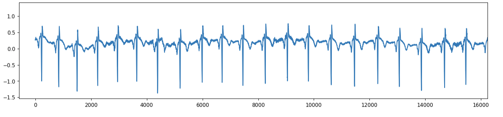
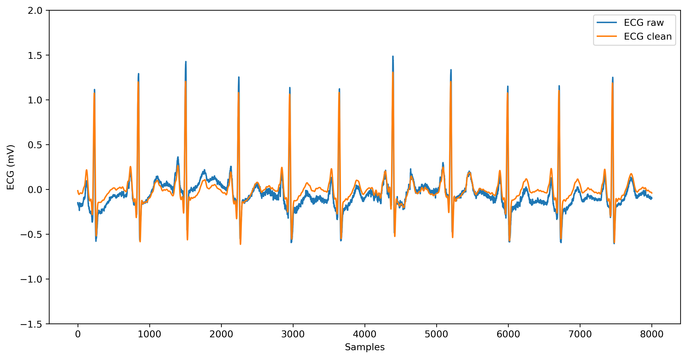
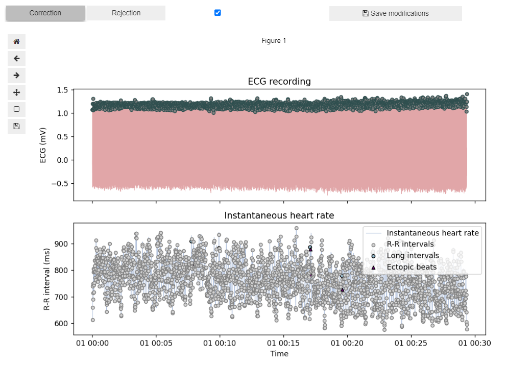
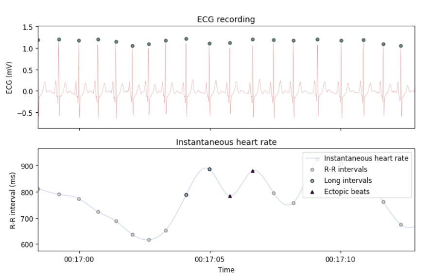
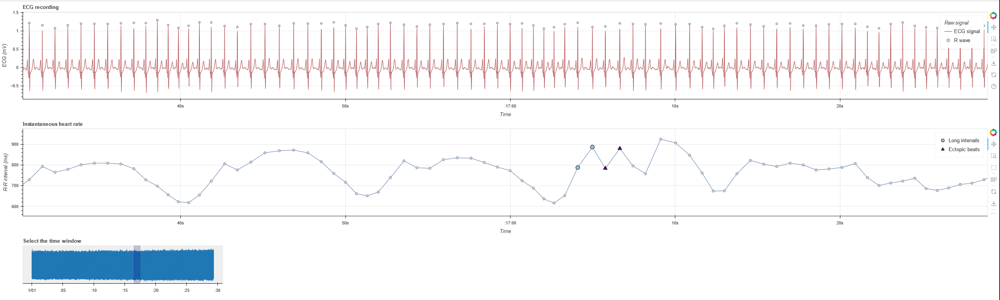
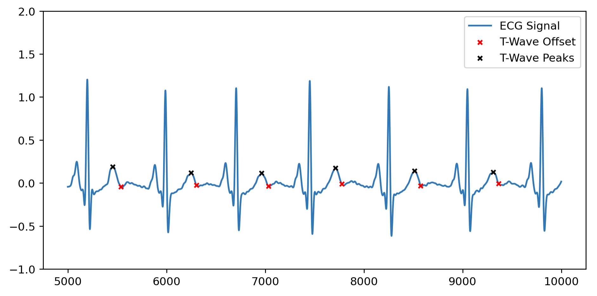
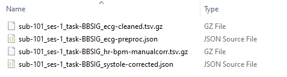

# **ECG preprocessing: `ecg_preproc.ipynb`**

This step-by-step tutorial will walk you through how to use the **Jupyter notebook for preprocessing raw ECG data**, developed as part of the Brain-Body Analysis Special Interest Group (BBSIG). You can find this pipeline under the name: `ecg_preproc.ipynb`.


??? note "Never used a Jupyter notebook before?"

    If you have never used a Jupyter notebook before, visit our setup instructions in the [FAQs](https://martager.github.io/bbsig/faqs/#jupyter-notebooks). Especially if you are planning to perform the manual PPG peak correction, **we recommend following the instructions to run this pipeline locally** in your IDE of choice (e.g., VS Code, PyCharm). 


???+ warning "Before starting: multiple participants or one at a time?"

    Given the code-chunk nature of the Jupyter notebook, especially if you plan to use the interactive visualization for the manual correction of R-peaks (via Systole’s `Editor`), **we recommend you run the ECG preprocessing pipeline one participant at a time**. The participant ID is included in [Sect. 1](https://martager.github.io/bbsig/ecg-preprocessing/#1-data-import-and-conversion) during data import, so you can specify the ID of each participant you want to preprocess and then proceed to run the entire pipeline. 

    ``` py

    # Define the participant ID
    # If manual R-peak correction (Sect. 4) is selected, run this notebook one participant at a time
    participant_ids = ['101']  # Adjust as needed: it should correspond to <ID> of 'sub-<ID>' in BIDS format

    ```

    *The current version of the pipeline is primarily intended for manual inspection and correction of individual participants. As such, it does not yet support automatic looping over multiple participants. We are currently working on a new version that will allow you to do so.* 


## **Pipeline structure**

The following steps are included in the ECG preprocessing pipeline: 

1. [**Data import and conversion**](https://martager.github.io/bbsig/ecg-preprocessing/#1-data-import-and-conversion): import the BIDS-compliant `_physio.tsv.gz` and `_physio.json` files containing the raw ECG signal and its metadata, then convert them into appropriate formats for later processing stages. Optional step to rescale ECG signal (e.g., by 0.001 with BrainAmp ExG acquired via LSL) if needed. 

2. [**(Optional) ECG flipping and filtering**](https://martager.github.io/bbsig/ecg-preprocessing/#2-optional-ecg-flipping-filtering): if needed, flip the ECG signal using NeuroKit2’s `ecg_invert()` function, and/or clean the ECG signal using NeuroKit2’s `signal_clean()` function (50 Hz powerline filter, and 0.5-30 Hz band-pass 4th order Butterworth filters).

3. [**R-peak detection**](https://martager.github.io/bbsig/ecg-preprocessing/#3-r-peak-detection): custom function to detect R-peaks using either Systole’s `ecg_peaks()` with 'sleepecg' methods (default) or NeuroKit2’s `nk.ecg_peaks()` with 'neurokit' method. Additionally, the user can choose to run automated artifact correction. Uncorrected (and automatically corrected) R-peak indices are saved. 

4. [**Manual R-peak correction**](https://martager.github.io/bbsig/ecg-preprocessing/#4-r-peaks-manual-correction): manually identify and correct mis-detected R-peaks and/or label bad segments using Systole’s `Editor`(which saves a `corrected.json file` in the `derivatives` folder). 

5. [**(Optional) interactive visualization**](https://martager.github.io/bbsig/ecg-preprocessing/#5-optional-interactive-visualization): plot an interactive visualization of ECG signal with R-peaks and/or instantaneous heart rate using Systole’s `plot_raw()` function. Plots can either be shown inside the notebook (if `plot_within_notebook` is set to `True`) or opened in a browser as HTML files. 

6. [**QRS delineation and T-wave detection**](https://martager.github.io/bbsig/ecg-preprocessing/#6-qrs-delineation-and-t-wave-detection): delineate the onsets, peaks and offsets of main QRS features, including T-wave peaks, using NeuroKit2 `ecg_delineate()` function with 'dwt' method.

7. [**Data output**](https://martager.github.io/bbsig/ecg-preprocessing/#7-data-output): export the `_ecg-cleaned.tsv.gz` (optional) and `_ecg-preproc.json` files in BIDS-compliant format for each subject in `/derivatives/ecg-preproc/sub-xx/`. Additionally, an `_hr-bpm-{correction_type}.tsv.gz` file (optional) can be saved with interpolated HR (in BPM). 


## **Settings: optional pipeline steps**

This section defines a series of variables that can be set to `True` to include the corresponding pipeline steps:

| <div style="width:150px">Variable Name</div> | Function |
| :------------------------------------------- | :------- |
| **`ecg_scale`** (bool) <br>**`ecg_scale_factor`** (numeric) | **ECG re-scaling** ([Sect. 1](https://martager.github.io/bbsig/ecg-preprocessing/#1-data-import-and-conversion)): scales the ECG signal by a user-defined factor (e.g., 0.001 for BrainAmp ExG acquired via LSL) specified under `ecg_scale_factor`. For reference, ECG is canonically measured in millivolts (mV), with R-peak amplitude on average ≤2.0/2.5 mV. |
| **`ecg_flip`** (bool) | **ECG flipping** ([Sect. 2](https://martager.github.io/bbsig/ecg-preprocessing/#2-optional-ecg-flipping-filtering)): checks whether an ECG signal is inverted, and if so, corrects for this inversion using NeuroKit2’s [`nk.ecg_invert()`](https://neuropsychology.github.io/NeuroKit/functions/ecg.html#ecg-invert) function. Defaults to `False`. If you are unsure whether the original ECG signal is inverted or not, we recommended setting it to `True`. |
| **`ecg_filter`** (bool) |  **ECG filtering** ([Sect. 2](https://martager.github.io/bbsig/ecg-preprocessing/#2-optional-ecg-flipping-filtering)): cleans the ECG signal by applying a 50 Hz powerline filter + 0.5-30 Hz band-pass 4th order Butterworth filter using NeuroKit2’s [`nk.signal_filter()`](https://neuropsychology.github.io/NeuroKit/functions/signal.html#signal-filter) function. | 
| **`manual_correct`** (bool) | **Manual correction of R-peaks** ([Sect. 4](https://martager.github.io/bbsig/ecg-preprocessing/#4-r-peaks-manual-correction)): activates UI for manual correction of extra peaks, missed peaks, and falsely detected peaks, using Systole's `Editor`. The UI can also be used to annotate bad segments. Saves a JSON file with the corrected peaks and bad segments. |
| **`interactive_ecg_plot`** (bool) | **Interactive plot of ECG signal and R-peaks** ([Sect. 5](https://martager.github.io/bbsig/ecg-preprocessing/#5-optional-interactive-visualization)): displays an interactive plot of the raw ECG signal with R-peak locations and heart rate using Systole's [`plot_raw()`](https://embodied-computation-group.github.io/systole/generated/plots/systole.plots.plot_raw.html#systole-plots-plot-raw) function. | 
| **`hr_interpol`** (bool) | **Save HR interpolation** ([Sect. 7](https://martager.github.io/bbsig/ecg-preprocessing/#7-data-output)): exports interpolated heart rate (HR) values in BPM using Systole's [`utils.heart_rate()`](https://embodied-computation-group.github.io/systole/generated/utils/systole.utils.heart_rate.html#systole-utils-heart-rate), as a TSV file with same sampling rate as original recording. | 


## **1. Data import and conversion**

This section imports the physiological data and metadata from the `_physio.tsv.gz` and sidecar `_physio.json` files in the BIDS directory and extracts the ECG data into a DataFrame (`ecg_df`) and numpy array (`ecg_arr`). In detail:

- **Define participants and BIDS file paths**:  first, the user specifies the participant ID(s) in the `participant_ids` list. If planning to conduct manual corrections, it is recommended to include **only one participant at a time**. The user must specify the root directory of BIDS-compliant raw data storage (`wd`), as well as the mandatory (i.e., task label, datatype) and optional (i.e. session label) BIDS entities (in the format `task-<label>`, `<datatype>` and `ses-<label>`, respectively). These will be used to create a base filename according to BIDS conventions (e.g., `sub-<ID>{_ses-<label>}_task-<label>`) and a base BIDS directory including subject, session (optional) and datatype (e.g., `'sub-<ID>/[ses-<label>/]<datatype>/'`).
- **Check for `_physio.tsv.gz` and `_physio.json` files**: ensures the raw ECG signal and metadata files for the specified participant are present. If either file is missing, the participant is skipped with a warning message.
- **Extract and parse metadata**: reads the JSON file to extract key information, including sampling frequency (saved as `sfreq`) and column names used to recognize the ECG data column when reading the TSV.GZ file (expects a column named `'cardiac'` according to BIDS conventions). Additionally reads and decompresses the TSV.GZ file into a pandas DataFrame (`physio_df`) using the extracted column names.
    - The `'cardiac'` column storing raw ECG data is renamed `'ecg'` for easier referencing. 
    - If `ecg_scale` is set to `True`, the ECG data is re-scaled according to the specified `ecg_scale_factor` and then stored in a DataFrame (`ecg_df`) and numpy array (`ecg_arr`).
- **Define the derivatives path for ECG preprocessed data storage**: defines and creates the directory for storing ECG preprocessed data, i.e. `derivatives/ecg-preproc/sub-<ID>/...`. 

Please keep in mind that data import parameters must be adapted if your data and/or directories are not BIDS-compliant (check how in the [Organize your BIDS folders](https://martager.github.io/bbsig/bids-structure/) section).

???+ note "Which BIDS entities should be specified for data import?"

     This is what the setup of mandatory and optional BIDS entities could look like to load a physio data file called `sub-101_ses-1_task-BBSIG_physio.tsv.gz` for a given participant called `sub-101`, with one session (`ses-1`), and datatype `beh`, stored in the following BIDS-compliant raw data structure `C:\YourBIDSFolder\sub-101\ses-1\beh\`. Unfortunately, in its current version, the pipeline only allows users to **process  one participant and one session at a time**. If your data contains multiple sessions, the `session_idx` variable must be changed every time. 

    ``` py
    # Define the participant ID
    # If manual R-peak correction (Sect. 4) is selected, run this notebook one participant at a time
    participant_ids = ['101']  # Adjust as needed: it should correspond to <ID> of 'sub-<ID>' in BIDS format

    # Specify the main directory of data storage (containing BIDS-compliant raw data)
    wd = r'C:\YourBIDSFolder' # change with the directory of data storage

    # Mandatory: BIDS entities (task, datatype)
    task_name = 'BBSIG'       # <label> of 'task-<label>' used for file naming in BIDS format
    datatype_name = 'beh'     # datatype used for corresponding directory in BIDS format (e.g., 'beh', 'eeg', 'func')
    physio_name = 'physio'    # physio data specification in BIDS format

    # Optional: BIDS entities (session)
    session_idx = '1'         # <label> of 'ses-<label>' in BIDS format, if available; otherwise, set to None
    ```
    Moreover, if you have additional BIDS entities (e.g., `'run-<label>'` or `'recording-<label>'`), you can easily add them by changing the corresponding `bids_base_fname` variable, as this will only impact file naming but not folder structure. This base BIDS filename will be inherited by all data import and export functions. You can read more about mandatory and optional entities in our [short BIDS glossary](https://martager.github.io/bbsig/bids-structure/#the-bids-folder-structure). 

    ``` py
    # If you have additional BIDS entities (e.g., 'run' or 'recording') you can change the bids_base_fname variable accordingly
    bids_base_fname = f'{subj_id}_ses-{session_idx}_task-{task_name}_run-{run_idx}_recording-{rec_name}' 
    ```

The main output from this section is a numpy array called `ecg_arr`, which includes the raw ECG signal (ideally, in mV), as shown below. This array is the basis of our ECG preprocessing: it will be cleaned in [Sect. 2](https://martager.github.io/bbsig/ecg-preprocessing/#2-optional-ecg-flipping-filtering) via filtering options (only if `ecg_filter` is set to `True`) or the raw form will be used for R-peak detection ([Sect. 3](https://martager.github.io/bbsig/ecg-preprocessing/#3-r-peak-detection)). 

Example structure of `ecg_arr`: 
``` ipython3
[-0.14894234 -0.16286522 -0.16502208 -0.16208112 -0.1652874  -0.16653465
 -0.17329076 -0.17646152 -0.1737763  -0.17040654 -0.17478665 -0.1772177
 -0.17397389 -0.18629727 -0.18957191 -0.1972182  -0.1962805  -0.19119135
 -0.19838545 -0.19189452]
```


## **2. (Optional) ECG flipping & filtering**

This section includes a series of optional preprocessing steps for ECG signal correction and cleaning. In detail: 

### 2a. ECG flipping
If the variable `ecg_flip` is set to `True` in the optional pipeline steps (see settings above - defaults to `False`), this part of the code will:

- **Check whether an ECG signal is inverted, and if so, correct for this inversion** using NeuroKit2’s [`nk.ecg_invert()`](https://neuropsychology.github.io/NeuroKit/functions/ecg.html#ecg-invert). 
- Store the resulting flipped ECG signal `ecg_inverted` as `ecg_arr`, if the original signal is found to be inverted, so that the next steps can be conducted on the correctly oriented signal. 
- Print a summary indicating whether the original ECG signal was found to be inverted and subsequently corrected.  

``` py
# Flip the ECG signal if inverted - set force to "False" checks whether the signal is inverted and, if so, flips it 
# If `force` is set to `True`, inversion of the signal is applied regardless of whether it is detected as inverted.
# If `show` is set to `True`, a plot of the original and inverted ECG signal is shown
ecg_inverted, is_inverted = nk.ecg_invert(ecg_arr, sampling_rate=sfreq, show=False, force=False) 
ecg_arr = ecg_inverted.copy()
```

??? hint "Unsure whether your ECG signal is inverted?"
    If unsure whether your original ECG signal is inverted, we recommend setting `ecg_flip` to `True`. Using [`nk.ecg_invert()`](https://neuropsychology.github.io/NeuroKit/functions/ecg.html#ecg-invert) with the argument `force=False` will conduct a first internal check of the inversion, and only apply the flipping if necessary.

    For reference, this is what an originally inverted ECG signal (i.e., R-peaks pointing down) would look like:

    

### 2b. ECG filtering
If the variable `ecg_filter` is set to `True` in the optional pipeline steps (see settings above - defaults to `True`), this part of the code will:

- **Apply filtering to the ECG signal** using NeuroKit2’s [`nk.signal_filter()`](https://neuropsychology.github.io/NeuroKit/functions/signal.html#signal-filter) function. Filters include a **50 Hz powerline filter**, plus **0.5 Hz high-pass and 30 Hz low-pass 4th order Butterworth filters**.
- Store the resulting clean ECG signal as the array `ecg_clean`.

``` py
# Apply filtering to the ECG signal: 50 Hz powerline filter, 
# 0.5 Hz 4th Butterworth high-pass filter, 30 Hz 4th Butterworth low-pass filter
ecg_clean = nk.signal_filter(ecg_arr, sampling_rate=sfreq, lowcut=0.5, highcut=30, 
                             method='butterworth', order=4, powerline=50, show=False)
```

For reference, this is how the original raw ECG signal (blue; corresponding to the data points in `ecg_arr`) compares to the cleaned ECG signal (orange; corresponding to the data points in `ecg_clean`) after applying these filters:



!!! warning
    If ECG filtering is not enabled, please keep in mind that all the subsequent steps (from [Sect. 3](https://martager.github.io/bbsig/ecg-preprocessing/#3-r-peak-detection) onwards) have to be conducted on the original raw ECG signal (`ecg_arr`). For reference, some algorithms for R-peak detection and QRS delineation perform better on clean vs. raw ECG signal. 


## **3. R-peak detection**

This section performs **R-peak detection** on the provided ECG signal and **optionally applies automated R-peak correction** based on the chosen method. In detail, this section:

*   Defines a custom function `detect_rpeaks()` for selecting the preferred method of R-peak extraction based on a BBSIG internal validation:    
    * The **default is Systole’s [`ecg_peaks(method='sleepecg')`](https://embodied-computation-group.github.io/systole/generated/detection/systole.detection.ecg_peaks.html)**, as it performed the most consistently across our various tests. 
    * Otherwise, the NeuroKit2’s method [`nk.ecg_peaks(method='neurokit')`](https://neuropsychology.github.io/NeuroKit/functions/ecg.html#ecg-peaks) can be selected.
*   If `correct_artifacts` is enabled, the code will perform automatic detection and correction of irregularities like missed or extra beats. 
    * For `'sleepecg'`, the fuction `systole.correction.correct_peaks()` is used; 
    * For `'neurokit'`, the correction is performed by the argument built in the NeuroKit2 R-peak detection function: `nk.ecg_peaks(correct_artifacts=True)`.


The function returns a dictionary with corrected and uncorrected R-peak indices, R-peak boolean arrays, and information about the detection method and artifact corrections (see the `detect_rpeaks()` function documentation within the Jupyter notebook for more info).

Here is an example of the usage of `detect_rpeaks()` with default options. If filtering was performed, we recommend using `ecg_clean` as input, then specify `sfreq` and set `correct_artifacts` to `True` (default). Since no `method` argument is provided in the example, the function uses the default method `'sleepecg’` from the Systole package.  

``` ipython3
# Perform the R-peak detection with the chosen method
# Specify "ecg_clean" if ecg signal filtering was applied, otherwise "ecg_arr"
rpeaks_dict = detect_rpeaks(signal=ecg_clean, sfreq=sfreq, correct_artifacts=True)
```

Here is an example output for `rpeaks_dict` generated with the above settings:
```
{'rpeaks_idx': array([ 230, 842, 1501, ..., 1761039, 1761633, 1762210],
	dtype=int64),
'rpeaks_bool': array([False, False, False, ..., False, False, False]),
'info': {'method_peaks': 'sleepecg',
				'automated_correction': 'True',
				'ECG_R_Peaks': array([ 230, 842, 1501, ..., 1761039, 1761633, 1762210],
					dtype=int64),
				'ECG_R_Peaks_Uncorrected': array([ 230, 842, 1501, ..., 1761039, 1761633, 1762210],
					dtype=int64),
				'ectopic_idx_uncorr': array([ 602, 1314, 1315, 1518, 2005], dtype=int64),
				'long_idx_uncorr': array([ 590, 752, 1312, 1313, 1516, 1710, 1880], dtype=int64),
				'short_idx_uncorr': array([], dtype=int64),
				'extra_idx_uncorr': array([], dtype=int64),
				'missed_idx_uncorr': array([], dtype=int64),
				'info_correction': {'extra': 0, 
                                    'missed': 0}}}
```


## **4. R-peak manual correction**

### 4a. Manual R-peak correction: interactive plot

If enabled via `manual_correct`, this section triggers the **interactive manual correction of R-peak locations and identification of noisy segments in the ECG signal** using Systole’s `Editor` class. Both the raw ECG signal and instantaneous heart rate are plotted to check for artifacts (e.g., long/short beats, ectopic beats). This interactive plot features a "Correction" mode for deleting peaks or adding them at the local maxima within selected segments, as well as a "Rejection" mode for marking selected segments as ‘bad’. 

This is what the UI for manual R-peak correction looks like when importing your clean ECG signal and R-peaks locations:





You can use the tools on the left side to zoom into the signal, scroll along the time axis, or go the previous or next visualization step. 

- With **Correction mode** selected:
    - Click and drag the *left mouse button* to select a segment where all the peaks should be removed.
    - Click and drag the *right mouse button* to select a segment where a peak will be added at the local maximum.
- With **Rejection mode** selected:
    - Click and drag the *right mouse button* to select a segment that should be marked as a bad segment. This will be saved as a pair of indices indicating the onset and offset of the bad segment. 

You can read more about how manual correction works in the Systole official documentation: [Working with BIDS folders - Using the Editor to inspect raw signal](https://embodied-computation-group.github.io/systole/notebooks/6-WorkingWithBIDSFolders.html#using-the-editor-to-inspect-raw-signal). 

??? bug "Bug: recurrent `TypeError` using Systole's `Editor`"
    Just ignore the *TypeError: Figure.set_tight_layout() missing 1 required positional argument: 'tight'* error that will be printed every manual correction or bad segment annotation you perform using Systole's `Editor`. 


### 4b. Manual R-peak correction: data saving
Once done with manual correction in the UI, save the results by running the code block in this section. The corrected R-peak locations and bad segment indices are saved to a JSON file (`_systole-corrected.json`) in the `/derivatives/ecg-preproc/sub-<label>/` folder for further processing and analysis.

!!! warning
    Make sure that you run the `editor.save()` section (below) only after completing your manual R-peak correction. This will save the output `_systole-corrected.json` file with the information about the new R-peaks locations and bad segments idx pairs. 

    ``` py
    # Execute only when manual peak correction is done
    if manual_correct:
        editor.save()
    ```

??? bug "Bug: Is your sampling frequency different from 1000 Hz? Incorrect `Editor` timescale"

    **Caution when using Systole’s `Editor` for manual correction with sampling rates other than 1000 Hz!** Despite specifying the `sfreq` in the `Editor`’s arguments, the function appears to be using a default sampling frequency of 1000 Hz to calculate the time window of the interactive visualization. As a result, the `Editor` might display your ECG signal in an incorrect time scale, shorter or longer than its actual duration. Despite this bug in the visualization, the manually corrected R-peak and bad segment indices are saved correctly in the output `_systole-corrected.json` file. 

    - For example, if your `sfreq` is 500 Hz and your original ECG signal is 10 min long, the UI will plot the signal with a default sampling frequency of 1000 Hz (i.e. as if 1000 samples were included in 1 sec of recording). This squeezes the timescale of the ECG signal into half its length (i.e., 5 min) and plots equally incorrect RR interval durations for the instantaneous HR, e.g., each heart beat lasting 300 or 400 ms. 
    - A potential temporary solution could be to **resample your data to 1000 Hz**. 


## **5. (Optional) interactive visualization**

If `interactive_ecg_plot` is set to `True`, this section provides an **interactive visualization of the ECG signal with R-peaks and/or instantaneous HR using Systole `plot_raw()`**. If `plot_within_notebook` is set to `True`, the interactive plot will be rendered within the notebook using Bokeh as the backend, otherwise it will be opened as an HTML file within the browser. 

Within this interactive visualization, it is possible to scroll through the entire ECG recording as well as the instantaneous HR time series (in ms). The `plot_raw()` function also displays potential artifacts in the RR time series plot below by using different shapes and labels, e.g., ectopic beats, extra beats, long & short intervals. 

Running this section will either plot within the notebook or open an HTML file that looks like this: 



!!! note
    If manual correction was performed, the manually corrected R-peaks are imported from `_systole-corrected.json` file and displayed in this interactive visualization. Otherwise, the automatically corrected R-peaks will be displayed. 


## **6. QRS delineation and T-wave detection**

This section **delineates the main features of the QRS complex, including the T-wave peak and T-wave offset**. It utilizes the `nk.ecg_delineate()` function from NeuroKit2 to perform the QRS delineation. The default delineation method used is `'dwt'` (Discrete Wavelet Transform). You can read more about it in the official NeuroKit2 documentation: [Locate P, Q, S and T waves in ECG](https://neuropsychology.github.io/NeuroKit/examples/ecg_delineate/ecg_delineate.html).

This section returns a binary array (`qrs_bin`) indicating the presence of various QRS complex events and a dictionary (`qrs_idx`) of the indices of QRS-peaks, QRS-onsets, and QRS-offsets. The following ECG features will be included:

- P-peaks, P-onsets, and P-offsets
- Q-peaks
- R-onsets (i.e., Q-onsets) and R-offsets (i.e., S-offsets)
- S-peaks
- T-peaks, T-onsets, and T-offsets

The resulting `qrs_idx` dictionary will be structured like this:
``` ipython3
{'ECG_P_Peaks': [nan,   733,  1394,  2131,  2843,  ...],
 'ECG_P_Onsets': [nan,  710,  1367,  2105,  2818,  ...],
 'ECG_P_Offsets': [nan,  774,  1430,  2171,  2879,  ...],
 'ECG_Q_Peaks': [203,  816,  1476,  2214,  2926, ...],
 'ECG_R_Onsets': [nan,  798,  1458,  2196,  2908, ...],
 'ECG_R_Offsets': [277,  887,  1546,  2287,  3004, ...],
 'ECG_S_Peaks': [258,  870,  1529,  2268,  2982, ...],
 'ECG_T_Peaks': [501,  1105,  1763,  2499,  3195,  ...],
 'ECG_T_Onsets': [358,  1000,  1754,  2354,  3127,  ...],
 'ECG_T_Offsets': [532,  1139,  1803,  2558,  3221,  ...]}
```

For reference, here is an example of T-wave offsets (red) and T-wave peaks (black), detected using `'dwt'` (Discrete Wavelet Transform) implemented in NeuroKit2, plotted on the clean ECG signal:



## **7. Data output**

This section exports the ECG preprocessing output files in BIDS-compliant format for each subject in `derivatives/ecg-preproc/sub-xx/`.

### 7a. (Optional) Export raw and clean ECG data
A custom function, `save_ecg_cleaned()`, saves the **`_ecg-cleaned.tsv.gz`** file with two columns: **`ecg_raw`**(the original ECG data) and **`ecg_cleaned`** (the filtered ECG signal, created by the optional filtering in [Sect. 2](https://martager.github.io/bbsig/ecg-preprocessing/#2-optional-ecg-flipping-filtering), if `ecg_filter` is set to `True`). This ensures easy access for later stages of analysis and enhances reproducibility. 

If ECG filtering was performed at the beginning, this section saves the `_ecg-cleaned.tsv.gz` file with two columns: the original ECG recording (`ecg_raw`) and the cleaned ECG signal with the applied filtering options (`ecg_cleaned`). 

This is how the `_ecg-cleaned.tsv.gz` TSV file might look (after decompression): 
```ipython3
ecg_raw      ecg_cleaned
-0.148942    -0.014682
-0.162865    -0.018444
-0.165022    -0.022173
-0.162081    -0.025835
-0.165287    -0.029398
```

### 7b. Export main ECG preprocessing features
A custom function, `save_ecg_preproc()`, saves the **`_ecg-preproc.json` file with R-peak indices, QRS complex features, and bad segment indices**. 

- **`rpeaks`** contains the following data: `ECG_R_Peaks_Uncorr` for uncorrected R-peak indices; `ECG_R_Peaks_AutoCorr` for auto-corrected R-peak indices, if either Systole's `correct_peaks()` or NeuroKit's `nk.ecg_peaks(correct_artifacts=True)` were used; `ECG_R_Peaks_ManualCorr` for manually corrected R-peaks using Systole's `Editor`.  
- **`qrs`** contains data for delineated QRS complex features obtained using NeuroKit2’s `nk.ecg_delineate()` function. Specifically:
    * P-peaks, P-onsets, and P-offsets
    * Q-peaks
    * R-onsets and R-offsets
    * S-peaks
    * T-peaks, T-onsets, and T-offsets
- **`rr_s`** contains the RR interval time series (in seconds) created using Systole's `input_conversion(output_type='rr_s')`, based on the uncorrected, auto-corrected, or manually corrected R-peaks indices  (if present). 
- **`bad_segments`**, if present, contains index pairs indicating the onsets and offsets of ECG signal segments marked as "bad" using Systole's `Editor`. 
- **`info`** contains metadata about the chosen R-peak detection procedures (e.g. method, artifact correction). Its structure changes depending on whether the 'sleepecg' or 'neurokit' method  was applied.

This is the crucial final step of our BBSIG ECG preprocessing pipeline. It stores all the features that have been calculated so far, including: R-peak locations (uncorrected, automaticallly corrected, and/or manually corrected if present); QRS complex feature locations; RR interval time series (based on uncorrected, automatically corrected and/or manually corrected R-peaks if present), bad segment indices; metadata about the chosen R-peak detection method. These are all saved as lists of values (e.g., indices for `rpeaks` or seconds for `rr_s`) under the corresponding keys. 

Below is an example of how different sections of the `_ecg-preproc.json` file could look:
``` json
{
    "rpeaks": {
        "ECG_R_Peaks_Uncorr": [ 230, 842, 1501, ...],
        "ECG_R_Peaks_AutoCorr": [ 230, 842, 1501, ...],
        "ECG_R_Peaks_ManualCorr": [ 230, 842, 1501, ...]
    },
    "qrs": {
        "ECG_P_Peaks": [ null, 733, 1394, ...],
        "ECG_P_Onsets": [ null, 710, 1367, ...],
        "ECG_P_Offsets": [ null, 774, 1430, ...],
        "ECG_Q_Peaks": [ 202, 815, 1475, ...],
        "ECG_R_Onsets": [ null, 798, 1458, ...],
        "ECG_R_Offsets": [ 277, 887, 1546, ...],
        "ECG_S_Peaks": [ 257, 869, 1528, ...],
        "ECG_T_Peaks": [ 501, 1105, 1763, ...],
        "ECG_T_Onsets": [ 358, 1000, 1754, ...],
        "ECG_T_Offsets": [532, 1139, 1803, ...]
    },
    "rr_s": {
        "RR_s_Uncorr": [ 0.612, 0.659, 0.739, ...],
        "RR_s_AutoCorr": [ 0.612, 0.659, 0.739, ...],
        "RR_s_ManualCorr": [ 0.612, 0.659, 0.739, ...]
    },
    "bad_segments": [ 594607, 599229],
    "info": {
        "method_peaks": "sleepecg",
        "automated_correction": "True",
        "ectopic_idx_uncorr": [ 602 ],
        "long_idx_uncorr": [ 590 ],
        "short_idx_uncorr": [],
        "extra_idx_uncorr": [],
        "missed_idx_uncorr": [],
        "info_correction": {
            "extra": 0,
            "missed": 0
        }
    }
}
```

### 7c. (Optional) Export interpolated HR (in BPM)

A custom function, `save_hr_interpol()`, saves the **interpolated heart rate (HR) values in BPM from the RR interval time series** with the selected correction type (i.e., uncorr, autocorr or manualcorr) to a new file ending in `_hr-bpm-{correction_type}.tsv.gz`. **Cubic interpolation** is used by default. Please note that interpolated HR values before the first RR interval and after the last RR interval will be filled with NaN values. 

??? bug "Bug: Incorrect HR interpolation with Systole’s `heart_rate()` with sampling frequences other than 1000 Hz"

    We have identified a **bug in Systole's `heart_rate()` function whenever the `sfreq` argument is set to any value other than the default 1000 Hz**. The interpolated HR values in BPM are incorrectly scaled by the value of `sfreq`, leading to inaccurate results. For example, for an RR interval of 992 ms, which should correspond to 60.48 bpm, calling `heart_rate(sfreq=500)` returns an incorrectly interpolated HR of 30.24 bpm, exactly half the expected value. As a temporary fix, we keep the argument `sfreq` to its default (1000 Hz) when calling this function within the custom `save_hr_interpol()` block. This ensures that interpolated HR values remain correct regardless of the original ECG signal's sampling frequency. 
    
    We are waiting for an official fix from the maintainers of Systole. You can track the progress or read more about this bug here: [opened issue on GitHub](https://github.com/embodied-computation-group/systole/issues/75). 

This is what the `_hr-bpm-{correction_type}.tsv.gz` file might look (after decompression) - note that the values shown do not include the NaN values before the first RR interval (which lasted 0.612 s): 
```ipython3
     hr_bpm_manualcorr
...          ...     
612          98.039216
613          98.038904
614          98.038548
615          98.038148
616          98.037704
```


## **Good job, your ECG preprocessing is done! 🥳**

If you enabled all optional steps, these are the files which will now be included in the `derivatives/ecg-preproc/sub-<label>/` directory:

- **`_ecg-preproc.json`**: stores the main ECG preprocessing features, including R-peak indices (uncorrected, auto-corrected, and manually corrected), QRS feature indices, RR time-series derived from the R-peak indices, and metadata about artifacts, bad segments, and correction. 
- **`_ecg-cleaned.tsv.gz`**: if you enabled the parameter `ecg_clean` in [Sect. 2](https://martager.github.io/bbsig/ecg-preprocessing/#2-optional-ecg-flipping-filtering), stores the raw and cleaned ECG signal. 
- **`_systole-corrected.json`**: if you performed manual R-peak correction and saved its output, stores the Systole's `Editor` output with manually corrected R-peaks and bad segment indices. See [Sect. 4](https://martager.github.io/bbsig/ecg-preprocessing/#4-r-peaks-manual-correction)
- **`_hr-bpm-{correction_type}.tsv.gz`**: if you enabled the parameter `hr_interpol` in [Sect. 6](https://martager.github.io/bbsig/ecg-preprocessing/#6-qrs-delineation-and-t-wave-detection), stores the interpolated HR values in BPM.


{ width="500" }
/// caption
///

???+ note "What does the BIDS directory look like after running the ECG preprocessing pipeline?"

    Let's come back to the example BIDS directory from the beginning, where we wanted to preprocess the physio data for a given participant, `sub-101`, with one session (`ses-1`) and datatype `beh`. After running this ECG preprocessing pipeline, the BIDS structure should now include a `derivatives/ecg-preproc` folder with sub-folders for each participant, session (optional), and datatype. Within this last folder, the four main output files should be stored. 

    ``` ipython3
    └─ YourBIDSFolder/
        ├─ derivatives/ 
        │   └─ ecg-preproc/
        │       ├─ sub-101/
        │       │   └─ ses-1/
        │       │       └─ beh/
        │       │           ├─ `sub-101_ses-1_task-BBSIG_ecg-cleaned.tsv.gz`        # optional
        │       │           ├─ `sub-101_ses-1_task-BBSIG_ecg-preproc.json`          # main output
        │       │           ├─ `sub-101_ses-1_task-BBSIG_hr-bpm-manualcorr.tsv.gz`  # optional      
        │       │           └─ `sub-101_ses-1_task-BBSIG_systole-corrected.json`    # optional
        │       ├─ sub-102/
        │       └─ ...
        ├─ sub-101/
        │   └─ ses-1/
        │       └─ beh/
        │           ├─ `sub-101_ses-1_task-BBSIG_physio.json`
        │           └─ `sub-101_ses-1_task-BBSIG_physio.tsv.gz`
        ├─ sub-102/
        └─ ... 
    ```