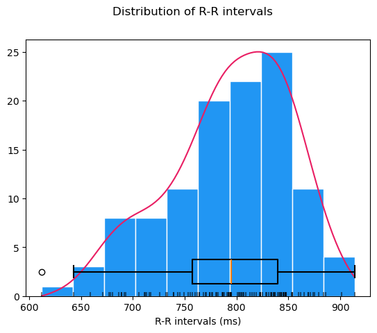
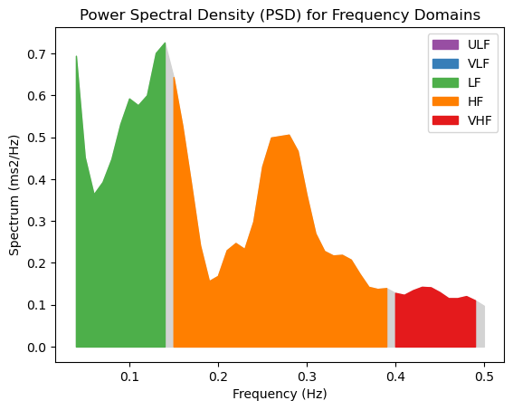
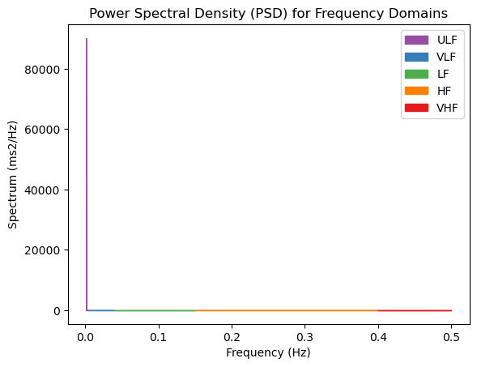
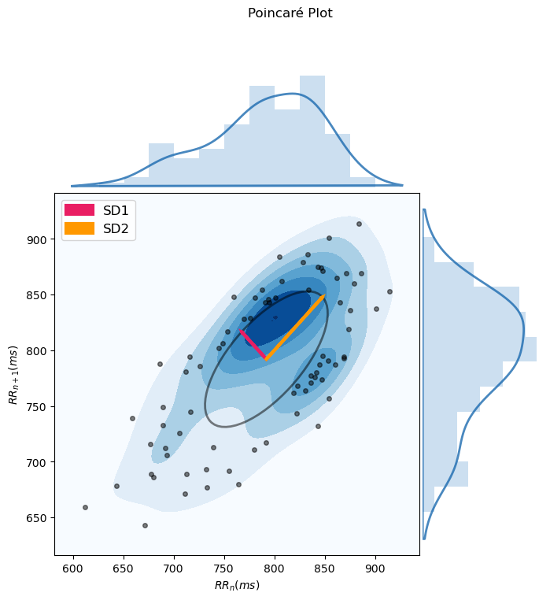
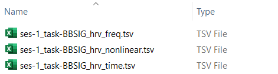

# **Heart Rate Variability (HRV) analysis: `hrv_analysis.ipynb`**

This step-by-step tutorial will walk you through how to use the **Jupyter notebook for conducting Heart Rate Variability (HRV) analysis** on your preprocessed ECG or PPG data, developed as part of the Brain-Body Analysis Special Interest Group (BBSIG). You can find this pipeline under the name: `hrv_analysis.ipynb`.

??? note "Never used a Jupyter notebook before?"

    If you have never used a Jupyter notebook before, visit our setup instructions in the [FAQs](https://martager.github.io/bbsig/faqs/#jupyter-notebooks). If you are planning to perform manual PPG peak correction, **we recommend following the instructions to run this pipeline locally** in your IDE of choice (e.g., VS Code, PyCharm). 


## **Compatible data sources**

This HRV analysis pipeline is designed for **optimal interaction with RR interval time series derived from preprocessed ECG/PPG data using our BBSIG pipelines**. For minimal setup, we recommend running the `ecg_preproc.ipynb` or `ppg_preproc.ipynb` notebook beforehand, which will generate the preprocessed ECG/PPG output files in BIDS-compliant format. However, if you have acquired your own RR interval data, the HRV analysis pipeline will work with custom TSV/CSV/TXT files, as long as they meet a few formatting requirements.  

Select the tab below based on your data source for RR intervals: 

=== "BBSIG Preprocessed Data"

    If you have correctly run the `ecg_preproc.ipynb` or `ppg_preproc.ipynb` pipeline, the preprocessed ECG/PPG output files for each participant will be stored under `derivatives/ecg-preproc/sub-<label>/` or `derivatives/ppg-preproc/sub-<label>/`. Each participant should have a corresponding **`_ecg-preproc.json` or `_ppg-preproc.json` file** containing the RR interval time series.  

    To ensure proper data loading, the following parameters must be specified in the [Additional Settings](https://martager.github.io/bbsig/hrv-analysis/#additional-settings) section at the beginning of the notebook:   
    
    - `bbsig_preproc = True` in order to import the JSON files generated during the BBSIG-based preprocessing.
    - `rri_unit = 's'` (as the BBSIG pipeline natively saves RR intervals in seconds). 
    - `physio_type = 'ecg'`/`'ppg'`, depending on the peripheral physiological modality of your raw data.
    - `rr_type = 'manualcorr'`/`'autocorr'`/`'uncorr'`, determines which type of RR interval data to extract from the R-peak correction steps. 

    Example setup to import ECG data preprocessed using the BBSIG pipeline: 
    ``` py
    ### Specify whether the data is BBSIG preprocessed output or custom file ###

    # Define whether the preprocessed ECG/PPG data were generated using the BBSIG pipeline
    bbsig_preproc = True  # set to True if data from the 'ecg-preproc' or 'ppg-preproc' folder is used
    rri_unit = 's'      # RR interval unit; 's' for seconds, 'ms' for milliseconds

    # Parameters for `bbsig_preproc = True`: BBSIG-compatible preprocessed file
    if bbsig_preproc: 
        physio_type = 'ecg'  # specify the type of physiological data ('ecg', 'ppg') if bbsig_preproc was used
        rr_type = 'autocorr' # specify the type of RR interval data to extract (either 'manualcorr', 'autocorr', or 'uncorr')

    ```


=== "Custom RR Intervals File"

    If you have your own RR interval data which was not derived from a BBSIG preprocessing pipeline, you can **still use the current pipeline with a custom file**. Just follow these formatting and data storage requirements: 
    
    - Store the **RR interval time series in a single column**, one value per row. The column **may or may not have a header row**. 
    - Save such formatted RR intervals as a separate **TSV/CSV/TXT file for each participant** using the following BIDS-compliant file naming standards: `sub-<label>[_ses-<label>]_task-<label>_rr.{tsv/csv/txt}`. It is important to use the **suffix `_rr.{tsv/csv/txt}`** with the correct file extension. 
    - Organize these custom files under the participant-specific **`derivatives\sub-<label>\[ses-<label>\]<datatype>\` directories**. 

    Here is an example of a directory storing a custom `_rr.tsv` file with RR intervals:
    ``` ipython3
    └─ YourBIDSFolder/
        ├─ derivatives/ 
        │   └─ sub-101/
        │       └─ ses-01/
        │           └─ beh/
        │               └─ `sub-101_ses-01_task-BBSIG_rr.tsv`   # custom TSV file with RR interval time series
        └─ ... 
    ```

    To ensure proper data loading, the following parameters must be specified in the [Additional Settings](https://martager.github.io/bbsig/hrv-analysis/#additional-settings) section at the beginning of the notebook:
    
    - `bbsig_preproc = False` in order to import the custom file with the RR interval time series. 
    - `rri_unit = 's'`/`'ms'`, depending on whether your original RR interval values are expressed in seconds or milliseconds. 
    - `file_type = 'tsv'`/`'csv'`/`'txt'` to match the file extension.
    - `file_header` can be set to `None` if no header is present; otherwise, defaults to `0`, i.e., the first row. 
    - `column_rr` can be set to the column index containing the RR interval time series (if you have only one column, this will correspond to `column_rr=0`, i.e., the first column). 

    Example of a custom TSV file with one column storing RR intervals (in seconds), without a header:
    ``` ipython3
    0.948
    0.925
    0.902
    0.876
    0.847
    ```

    Example setup to import this custom TSV file, without a header and with only one colum: 
    ``` py
    ### Specify whether the data is BBSIG preprocessed output or custom file ###

    # Define whether the preprocessed ECG/PPG data were generated using the BBSIG pipeline
    bbsig_preproc = False   # set to True if data from the 'ecg-preproc' or 'ppg-preproc' folder is used
    rri_unit = 's'          # RR interval unit; 's' for seconds, 'ms' for milliseconds

    [...]

    # Parameters for `bbsig_preproc = False`: custom file 
    if not bbsig_preproc: 
        file_type = 'tsv'   # specify the file type ('tsv', 'csv', 'txt') for loading data
        file_header = None  # set to None if no header, otherwise 0 if header is first row (0-based)
        column_rr = 0       # specify the column index (0-based) for RR intervals
    ```


## **Notebook structure**

This notebook contains the following sections which define functions for use in the main analysis loop of the HRV preprocessing pipeline: 

1. [**Data import and conversion**](https://martager.github.io/bbsig/hrv-analysis/#1-data-import-and-conversion): import and format the RR interval time series either from the BBSIG-preprocessed JSON files (`_ecg-preproc.json` or `ppg-preproc.json`) or from custom TSV/CSV/TXT files (`_rr.{tsv/csv/txt}`). Convert them to milliseconds (if needed) and compute the corresponding R-peak timestamps, stored in the `rrs_dict` dictionary for later processing stages.

2. [**(Optional) Data cropping**](https://martager.github.io/bbsig/hrv-analysis/#2-optional-data-cropping): crop the RR interval data to a specific time window using the custom function `hrv_window_crop()`. This specifies a temporal window (e.g., a 5-min block) for analysis based on a start time and either an end time or a duration (all in seconds). The cropped RR intervals and R-peak timestamps are then stored in a new dictionary: `cropped_rrs_dict`.

3. [**(Optional) Compute time-domain HRV metrics**](https://martager.github.io/bbsig/hrv-analysis/#3-optional-compute-time-domain-hrv-metrics): compute time-domain HRV metrics using the custom function `hrv_time_domain()` (based on NeuroKit2's `hrv_time()`) in order to extract various data (such as mean and median RR, mean and median HR, SDNN, RMSSD, and pNN50) and store them in a dictionary. Will also display a summary plot of time-domain HRV metrics if `show_plots=True`.

4. [**(Optional) Compute frequency-domain HRV metrics**](https://martager.github.io/bbsig/hrv-analysis/#4-optional-compute-frequency-domain-hrv-metrics): compute frequency-domain HRV metrics using the custom function `hrv_frequency_domain()` (based on NeuroKit2's `hrv_frequency()`) in order to extract spectral features (like VLF, LF, HF, LF/HF, LFn, HFn, and LnHF) and store them in a dictionary. Will also display a summary plot of frequency-domain HRV metrics if `show_plots=True`.

5. [**(Optional) Compute non-linear HRV metrics**](https://martager.github.io/bbsig/hrv-analysis/#5-optional-compute-non-linear-hrv-metrics): compute non-linear HRV metrics using the custom function `hrv_nonlinear()` (based on NeuroKit2's `hrv_nonlinear()`) in order to extract various features (like Poincaré plot SD1, SD2, SD1/SD2, ApEn and SampEn) and store them in a dictionary. Will also display a summary plot of non-linear HRV metrics if `show_plots=True`.

6. [**Data output**](https://martager.github.io/bbsig/hrv-analysis/#6-data-output): save all participants' computed HRV metrics (time-domain, frequency-domain, or non-linear, if present) to a summary TSV file under `derivatives/hrv-analysis/` using the custom function `save_hrv_data()`. The summary TSV files for each HRV metric can be distinguished using the suffix `_hrv_{time/freq/nonlinear}.tsv`.

7. [**Main Analysis Loop**](https://martager.github.io/bbsig/hrv-analysis/#7-main-analysis-loop): execute the desired analysis steps from the optional sections above, looping over all participants included in the `participant_ids` list at once.

!!! warning
    Sections 1 to 6 only define the optional functions which will be called in the [**Main analysis loop**](https://martager.github.io/bbsig/hrv-analysis/#7-main-analysis-loop). For any of these optional steps to be applied, the corresponding variable must be set to `True` in the settings below.

??? "Want to know more about the HRV metrics computed by NeuroKit2?"

    The NeuroKit2 creators have published a open-access paper [(Pham et al., 2021)](https://www.mdpi.com/1424-8220/21/12/3998) detailing the most commonly used HRV indices (time-domain, frequency-domain, non-linear) and how to use them in different research areas. The paper also includes a tutorial on how to compute these HRV metrics using NeuroKit2. 


## **Settings: optional pipeline steps**

This section defines a series of variables that can be set to `True` to include the corresponding optional pipeline steps:

| <div style="width:150px">Variable Name</div> | Function |
| :------------------------------------------- | :------- |
| **`compute_hrv_time`** (bool) | **Time-domain HRV computation** (Sect. 3): computes time-domain HRV metrics, including the Standard Deviation of NN intervals (`SDNN`), Root Mean Square of Successive Differences (`RMSSD`) and Proportion of NN intervals > 50ms difference (`pNN50`), using NeuroKit2's `hrv_time()` function. |
| **`compute_hrv_freq`** (bool) | **Frequency-domain HRV computation** (Sect. 4): computes frequency-domain HRV metrics, such as Low Frequency (`LF`) and High Frequency (`HF`) power, Low-to-High Frequency Ratio (`LF/HF`), using NeuroKit2's `hrv_frequency()` function with default method 'Welch' and interpolation rate set to `interpolation_freq = 4`. |
| **`compute_hrv_nl`** (bool) | **Non-linear HRV computation** (Sect. 5): computes non-linear HRV metrics, such as Poincaré plot SD1, SD2, SD1/SD2, ApEn and SampEn, using NeuroKit2's `hrv_nonlinear()` function. |
| **`show_plots`** (bool) | **NeuroKit2 HRV plotting**: displays NeuroKit2's built-in plots for each of the above HRV metrics. | 

!!! warning 
    At least one of the two options `compute_hrv_time` or `compute_hrv_freq` must be set to `True`!


## **Additional settings**

This section defines a series of settings specific to some pipeline steps, including:

### Settings: 1. Data import and conversion

**Define BIDS entities for data path info:**

Specify the participant ID(s) in the `participant_ids` list. The user must specify mandatory (i.e., task `<label>` in format `task-<label>`, datatype) and optional (i.e., session `<label>` in format `ses-<label>`) BIDS entities, which will be used to create a base filename according to BIDS conventions (e.g., `sub-<ID>{_ses-<label>}_task-<label>`) and a base BIDS directory including subject, session (optional) and datatype (e.g., `'sub-<ID>/{ses-<label>}/<datatype>/'`). 


**Specify whether using BBSIG or custom preprocessed data:**

=== "BBSIG Preprocessed Data"

    If the raw ECG/PPG data was preprocessed using a BBSIG pipeline, **`bbsig_preproc` must be set to `True`**. During data import, the BSSIG-related preprocessed JSON files from the corresponding `derivatives\{physio_type}-preproc\` folder will be loaded. The user has to specify the type of physiological data on which preprocessing was performed (i.e., `physio_type = 'ecg'` or `physio_type = 'ppg'`) and the type of RR interval data to extract, depending on the correction method used (i.e., `rr_type` set to either `'manualcorr'`, `'autocorr'`, or `'uncorr'`). For more details, see the ["BBSIG Preprocessed Data"](https://martager.github.io/bbsig/hrv-analysis/#__tabbed_1_1) tab. 

=== "Custom RR Intervals File"

    If the BBSIG pipelines were not used for preprocessing, `bbsig_preproc` must be set to `False`. During data import, a custom file containing RR intervals (either in seconds or milliseconds) for each participant will be loaded. The custom file should either be a TSV, CSV or TXT file, including **at least one column with the RR interval time series**, either with or without a header. The custom files for each participant should follow a BIDS-compliant naming scheme with the **suffix `_rr.{tsv/csv/txt}`**, and should be stored within the  `derivatives\sub-<label>\[ses-<label>]\<datatype>\` directory. The user must specify the time units of the RR intervals (i.e., `rri_unit = 's'` or `rri_unit = 'ms'`), the type of custom file to load (i.e., `file_type` set to `'tsv'`, `'csv'`, or `'txt'`), the header row index (if present, `file_header`; 0-indexed) and the column index containing the RR intervals (i.e., `column_rr`; 0-indexed). For more details, see the ["Custom RR intervals file"](https://martager.github.io/bbsig/hrv-analysis/#__tabbed_1_2) tab. 

### Settings: 2. (Optional) Data cropping

If `crop_window` is set to `True`, the user must specify parameters for **cropping a window from the original RR interval time series**. It is necessary to specify the **start time** of the window (`window_start_hrv`), in addition to either the **end time** (`window_end_hrv`) or the **cumulative duration** (`window_length_hrv`), all in seconds. Whichever of the latter is not specified (either `window_end_hrv` or `window_length_hrv`) must be set to `None`. 

If enabled, metadata regarding the chosen window start and end timepoints will be saved in a new `cropped_rrs_dict` for each participant.

Here is an example setup for cropping a window spanning from 0 to 90 seconds in the original data - subsequent HRV analysis will only be performed on this window: 
``` py
###### Settings: 2. (Optional) Data cropping ######

# Define whether cropping of a window of specified duration or start/end time is needed
crop_window = True  # set to True if needed

# Specify the parameters below if crop_window is set to True
# one out of window_end_hrv and window_length_hrv has to be specified, the other can be set to None
if crop_window: 
    window_start_hrv = 0  # mandatory: start of window for HRV analysis (in seconds)
    window_end_hrv = 90  # optional: end of window for HRV analysis (in seconds), otherwise set to None
    window_length_hrv = None  # window length for HRV analysis (in seconds), otherwise set to None
```

### Settings: 4. Frequency-domain HRV settings

If `compute_hrv_freq` is set to `True`, the user can specify the **sampling frequency for interpolating RR intervals for frequency-domain HRV analysis**. Defaults to 4 Hz, i.e., `interpolation_freq = 4`. 

``` py
####### Settings: 4. Frequency-domain HRV settings #######

# Specify the parameters below if compute_hrv_freq is set to True
if compute_hrv_freq: 
    interpolation_freq = 4  # sampling frequency for interpolating RR intervals for frequency-domain HRV analysis
```


## **1. Data import and conversion**

This section defines the **custom function `load_rr_data()` for importing RR interval time series** from either the ECG/PPG data preprocessed **using the BBSIG pipelines** (`bbsig_preproc = True`) **or a custom TSV/CSV/TXT file** (`bbsig_preproc = False`) for a given participant, and for converting them to the appropriate format for later processing stages (RR intervals in ms, R-peaks as timestamps). 

The function supports two data input modes:

- **From preprocessed JSON files generated by the BBSIG pipelines** (e.g., `_ecg-preproc.json` or `_ppg-preproc.json`) in the `derivatives` folder.
    - Extracts the manual, automatic, or uncorrected R-peak types from the JSON file (as specified by `rr_type`).
- **From custom TSV/CSV/TXT files** containing at least one column with the RR interval time series (`_rr.{tsv/csv/txt}`) in the `derivatives` folder. 
    - Extracts the RR interval time series from a given column (`column_rr`) excluding the header row (`file_header`), if present.

After loading the RR intervals from either the BBSIG-generated JSON file or the custom file, the function:

- Converts RR interval values from seconds to milliseconds (if needed)
- Computes R-peak timestamps as the cumulative sum of RR intervals 
- Stores a **dictionary `rrs_dict` containing RR intervals in ms (`RRI`) and R-peak timestamps (`RRI_Time`)**, in a format compatible with later NeuroKit2 functions. 

Example structure of `rrs_dict` for one participant: 
``` ipython3
{
    'RRI': array([612., 659., 739., ..., 828., 883., 873.]),                    # RR intervals in miliseconds
    'RRI_Time': array([ 612., 1271., 2010., ..., 597331., 598214., 599087.])    # R-peaks timestamps in seconds 
}
```

 
## **2. (Optional) Data cropping**

If `crop_window` is set to `True`, this section defines a **custom function `hrv_window_crop()` to crop RR interval data to a specific time window**. This is useful for analyzing a subset of an HRV recording (e.g., a 5-min rest block) instead of the entire session. The function extracts a specific segment of RR interval data **based on either a start and end time** or **a start time and a duration** (in seconds). The corresponding RR intervals and R-peak timestamps for the cropped window are stored in a new dictionary: `cropped_rrs_dict`.

Note: one of either `window_end` or `window_length` must be specified, while the other must be set to `None`. 

Example of `cropped_rrs_dict` for one participant using a window from 0 to 90 seconds:
``` ipython3
{
    'RRI': array([612., 659., 739., ..., 726., 786., 804.]),                    # RR intervals in miliseconds
    'RRI_Time': array([ 612., 1271., 2010., ..., 87910., 88696., 89500.])    # R-peaks timestamps in seconds 
}
```


## **3. (Optional) Compute time-domain HRV metrics**

If the variable `compute_hrv_time` is set to `True` in the optional pipeline steps (see settings above), this section defines the custom function `hrv_time_domain()` which performs the calculation of time-domain HRV metrics using NeuroKit2's `hrv_time()` function. The resulting time-domain metrics for the given participant are stored in the `hrv_time_metrics` dictionary. These metrics include:

- `MeanRR` and `MeanBPM`: mean RR duration in seconds and mean heart rate (HR) value in beats per minute (BPM)
- `MedianRR` and `MedianBPM`: median RR duration in seconds and median HR value in BPM
- `MinRR` and `MinBPM`: minimum RR duration in seconds and minimum HR in BPM
- `MaxRR` and `MaxBPM`: maximum RR duration in seconds and maximum HR in BPM
- `SDNN`: Standard Deviation of NN (normal-to-normal) intervals
- `SDSD`: Standard Deviation of Successive RR interval Differences 
- `RMSSD`: Root Mean Square of Successive Differences 
- `pNN50`: Proportion of successive NN intervals that differ more than 50ms (Bigger et al., 1988; Mietus et al., 2002).

For a full list of time-domain HRV metrics which can be added to the dictionary within the custom function, see the NeuroKit2 [documentation of `hrv_time()`](https://neuropsychology.github.io/NeuroKit/functions/hrv.html#hrv-time). If `show_plots` is set to `True` in the optional pipeline steps (see settings above), a plot for the computed time-domain HRV metrics will also be shown. 

Example of the `hrv_time_metrics` dictionary for one participant on the desired cropped window: 
``` ipython3
{
    'subjID': 'sub-101', 
    'MeanRR': 792.0353982300885, 
    'MeanBPM': 75.75418994413408, 
    'MedianRR': 795.0, 
    'MedianBPM': 75.47169811320755, 
    'MinRR': 612.0, 
    'MinBPM': 65.64551422319475, 
    'MaxRR': 914.0, 
    'MaxBPM': 98.03921568627452, 
    'SDNN': 61.34750681910679, 
    'SDSD': 48.26810047857201, 
    'RMSSD': 48.08270404804027, 
    'pnn50': 39.823008849557525, 
    'window_start': 0, 
    'window_end': 90
}

```

Here is an example of how NeuroKit2's built-in distribution plot of RR intervals might look: 




## **4. (Optional) Compute frequency-domain HRV metrics**

If the variable `compute_hrv_freq` is set to `True` in the optional pipeline steps (see settings above), this section defines the custom function `hrv_frequency_domain()` which performs the calculation of frequency-domain HRV metrics using NeuroKit2's `hrv_frequency()` function with the default method 'Welch' and 4 Hz interpolation (the interpolation rate can be changed by modifying the `interpolation_rate` variable in the settings above). The resulting frequency-domain metrics for the given participant are stored in the `hrv_freq_metrics` dictionary. These metrics include:

- `VLF`: Very Low Frequency power (by default, 0.0033 to 0.04 Hz)
- `LF`: Low Frequency power (by default, 0.04 to 0.15 Hz)
- `HF`: High Frequency power (by default, 0.15 to 0.4 Hz)
- `LF/HF`: ratio of Low-to-High Frequency power — often interpreted as a marker of autonomic balance
- `LFn`: normalized Low Frequency power, obtained by dividing the low frequency power by the total power
- `HFn`: normalized High Frequency power, obtained by dividing the high frequency power by the total power
- `LnHF`: natural logarithm of high frequency power

For a full list of frequency-domain HRV metrics which can be added to the dictionary within the custom function, see the NeuroKit2 [documentation of `hrv_frequency()`](https://neuropsychology.github.io/NeuroKit/functions/hrv.html#hrv-frequency). If `show_plots` is set to `True` in the optional pipeline steps (see settings above), a plot for the computed frequency-domain HRV metrics will also be shown.

Example of the `hrv_freq_metrics` dictionary for one participant on the desired cropped window: 
``` ipython3
{
    'subjID': 'sub-101', 
    'VLF': 0.0015943855081253808, 
    'LF': 6.160565454161458e-09, 
    'HF': 8.170534133301846e-12, 
    'LF/HF': 753.9978847957976, 
    'LFn': 2.6983097056702785e-12, 
    'HFn': 3.578670126377147e-15, 
    'LnHF': -25.53048683180052, 
    'window_start': 0, 
    'window_end': 90
}
```

Here is what NeuroKit2's built-in Power Spectral Density (PSD) plot for HRV frequency domains should look like: 




???+ bug "Bug with NeuroKit2's `hrv_frequency()` PSD plot - heavily skewed ULF values"

    While running the HRV analysis pipeline on RR interval time series of various lengths, including shorter cropped windows (~3 minutes), we encountered a persistent issue with the `hrv_frequency()` function. According to [Neurokit's documentation](https://neuropsychology.github.io/NeuroKit/functions/hrv.html#hrv-frequency), spectral power in the **Ultra Low Frequency (ULF) band** (< 0.003 Hz) should return **NaN** for short recordings due to insufficient frequency resolution.

    However, in our testing, the computed `HRV_ULF` consistently returned **unexpectedly high values**, such as:
    ``` ipython3
    HRV_ULF      HRV_VLF   HRV_LF        HRV_HF        HRV_VHF  
    2283.118628  0.001594  6.160565e-09  8.170534e-12  4.102655e-14   
    ```

    This leads to a **heavily skewed Power Spectral Density (PSD) plot** where the ULF component (in purple) dominates the y-axis. Unfortunately, the visualization becomes unusable for interpreting VLF, LF, and HF components, which disappear due to this scaling issue:

    

    We attempted to disable the ULF band (using the setting `ulf=None` inside the `hrv_frequency()` function), but this solution did not fix the issue. *We are currently planning to work on a parallel PSD visualization, in addition to opening an issue with the maintainers of NeuroKit2.*


## **5. (Optional) Compute non-linear HRV metrics**

If the variable `compute_hrv_nl` is set to `True` in the optional pipeline steps (see settings above), this section defines the custom function `hrv_nonlinear()` which performs the calculation of non-linear HRV metrics using NeuroKit2's `hrv_nonlinear()` function. The resulting non-linear metrics are stored in the dictionary `hrv_ln_metrics`, including:

- `SD1`: Poincaré plot standard deviation of the short-term variability component (i.e., the short-axis of ellipse).
- `SD2`: Poincaré plot standard deviation of the long-term variability component (i.e., the long-axis of ellipse).
- `SD1/SD2`: Poincaré ratio of short-term to long-term variability. 
- `S`: Poincaré plot area of the ellipse, proportional to SD1/SD2. 
- `ApEn`: [approximate entropy](https://neuropsychology.github.io/NeuroKit/functions/complexity.html#neurokit2.complexity.entropy_approximate), a measure of regularity and complexity of a time series.
- `SampEn`: [sample entropy](https://neuropsychology.github.io/NeuroKit/functions/complexity.html#neurokit2.complexity.entropy_sample), a more robust version of ApEn.

For a full list of non-linear HRV metrics which can be added to the dictionary within the custom function, see the NeuroKit2 [documentation of `hrv_nonlinear()`](https://neuropsychology.github.io/NeuroKit/functions/hrv.html#hrv-nonlinear). If `show_plots` is set to `True` in the optional pipeline steps (see settings above), a plot for the computed non-linear HRV metrics will also be shown. 

Example of the `hrv_ln_metrics` dictionary for one participant using a cropped window of 0 to 90 seconds: 
``` ipython3
{
    'subjID': 'sub-101', 
    'SD1': 34.130701163391905, 
    'SD2': 78.32001310664121, 
    'SD1/SD2': 0.4357851819677206, 
    'S': 8397.844611437116, 
    'ApEn': 0.6585571938830488, 
    'SampEn': 1.508184178728928, 
    'window_start': 0, 
    'window_end': 90
}
```

Here is what NeuroKit2's built-in Poincaré plot for non-linear HRV looks like: 




## **6. Data output**

This section defines a **custom function, `save_hrv_data()`, to save the computed HRV metrics** (time-domain, frequency-domain, and non-linear, if enabled) **of all participants to a summary TSV file**. In detail, this section will: 

- Convert the input `hrv_data` (a dictionary generated from one of the pipelines steps in [Sect. 3](https://martager.github.io/bbsig/hrv-analysis/#3-optional-compute-time-domain-hrv-metrics), [Sect. 4](https://martager.github.io/bbsig/hrv-analysis/#4-optional-compute-frequency-domain-hrv-metrics) or [Sect. 5](https://martager.github.io/bbsig/hrv-analysis/#5-optional-compute-non-linear-hrv-metrics)) into a DataFrame
- Create an output directory in `derivatives/hrv-analysis/`, if not already available.
- Save the DataFrame as a TSV file named according to the BIDS-compliant `task-<label>` and HRV analysis type (`time`, `freq`, or `nonlinear`), e.g., `task-rest_hrv_time.tsv`. 


## **7. Main analysis loop**

The optional pipeline steps from the previous sections are executed, as part of the main analysis loop, **if and only if they are flagged as enabled in the main loop**, which itself will run on every participant included in the `participant_ids` list. 

The main loop will also save the computed HRV metrics as TSV files with one row per participant. Please make sure that all the pipeline steps you wish to execute are set to `True` in the [Settings: optional pipeline steps](https://martager.github.io/bbsig/hrv-analysis/#settings-optional-pipeline-steps). :warning: Note that at least one of the two options `compute_hrv_time` or `compute_hrv_freq` must be `True`!

Here are all the sub-sections of the main analysis loop: 
``` py
# initialize empty lists to store HRV metrics
all_hrv_time = []
all_hrv_freq = []
all_hrv_nl = []

# Loop through each participant ID and perform HRV analysis
for subj in participant_ids:

    subj_id = 'sub-' + str(subj) # participant ID (in BIDS format)
    
    ############## Create base BIDS-compatible filename and directory ##############

    # If you have additional BIDS entities (e.g., 'run' or 'recording') you can change the base BIDS file name below
    # e.g., f'{subj_id}_ses-{session_idx}_task-{task_name}_run-{run_idx}_recording-{rec_name}' 
    if session_idx is not None:
        bids_base_fname = f'{subj_id}_ses-{session_idx}_task-{task_name}' 
        bids_base_dir = os.path.join(subj_id, f'ses-{session_idx}', datatype_name) # base BIDS folders incl. session 'sub-<ID>/ses-<label>/<datatype>/'
    else:
        bids_base_fname = f'{subj_id}_task-{task_name}'
        bids_base_dir = os.path.join(subj_id, datatype_name) # base BIDS folders without session 'sub-<ID>/<datatype>/' 


    ############## Sect. 1: Data import of RR intervals ##############
    rr = load_rr_data(wd, bids_base_fname, bids_base_dir, rr_type, rri_unit, bbsig_preproc=bbsig_preproc, physio_type=physio_type)


    ############## Sect. 2: Data cropping ##############
    if crop_window:
        rr, window_start, window_end = hrv_window_crop(rr, window_start=window_start_hrv, window_end=window_end_hrv, window_length=window_length_hrv)
    

    ############## Sect. 3: Computation of time-domain HRV, if required ##############
    if compute_hrv_time:
        hrv_time_metrics = hrv_time_domain(rr, subj, plot=show_plots)
        if crop_window:
            hrv_time_metrics['window_start'] = window_start     # save metadata about start of cropped window
            hrv_time_metrics['window_end'] = window_end         # save metadata about end of cropped window
        all_hrv_time.append(hrv_time_metrics)


    ############## Sect. 4: Computation of frequency-domain HRV, if required ##############
    if compute_hrv_freq:
        hrv_freq_metrics, hrv_f = hrv_frequency_domain(rr, subj, interpolation_freq, plot=show_plots)
        if crop_window:
            hrv_freq_metrics['window_start'] = window_start     # save metadata about start of cropped window
            hrv_freq_metrics['window_end'] = window_end         # save metadata about end of cropped window
        all_hrv_freq.append(hrv_freq_metrics)

    
    ############## Sect. 5: Computation of non-linear HRV, if required ##############
    if compute_hrv_nl:
        hrv_nl_metrics = hrv_nonlinear(rr, subj, plot=show_plots)
        if crop_window:
            hrv_nl_metrics['window_start'] = window_start       # save metadata about start of cropped window
            hrv_nl_metrics['window_end'] = window_end           # save metadata about end of cropped window
        all_hrv_nl.append(hrv_nl_metrics)


############## Sect. 6: Data output ##############

# If enabled, save TSV file with computed time-domain HRV metrics for all participants
if compute_hrv_time:
    save_hrv_data(wd, task_name, session_idx, all_hrv_time, 'time')
    print(pd.DataFrame(all_hrv_time))

# If enabled, save TSV file with computed frequency-domain HRV metrics for all participants
if compute_hrv_freq:
    save_hrv_data(wd, task_name, session_idx, all_hrv_freq, 'freq')
    print(pd.DataFrame(all_hrv_freq))

# If enabled, save TSV file with computed non-linear HRV metrics for all participants
if compute_hrv_nl:
    save_hrv_data(wd, task_name, session_idx, all_hrv_nl, 'nonlinear')
    print(pd.DataFrame(all_hrv_nl))
```


## **Good job, your HRV analysis is done! 🥳**

Your `derivatives/hrv-analysis/` directory should now include the following files - assuming you have enabled all optional steps; otherwise, you will certainly have either `_hrv-time.tsv` or `_hrv-freq.tsv`:

- **`_hrv-time.tsv`**: stores the summary table with the time-domain HRV metrics for all participants (see [Sect. 3](https://martager.github.io/bbsig/hrv-analysis/#3-optional-compute-time-domain-hrv-metrics)).
- **`_hrv-freq.tsv`**: stores the summary table with the frequency-domain HRV metrics for all participants (see [Sect. 4](https://martager.github.io/bbsig/hrv-analysis/#4-optional-compute-frequency-domain-hrv-metrics)).
- **`_hrv-nonlinear.tsv`**: stores the summary table with the non-linear HRV metrics for all participants (see [Sect. 5](https://martager.github.io/bbsig/hrv-analysis/#5-optional-compute-non-linear-hrv-metrics)).

{ width="500" }
/// caption
///

??? note "Example of the `_hrv-time.tsv` summary table"

    | subjID | MeanRR | MeanBPM | MedianRR | MedianBPM | MinRR | MinBPM | MaxRR | MaxBPM | SDNN | SDSD | RMSSD | pnn50 | window_start | window_end | 
    | --- | --- | --- | --- | --- | --- | --- | --- | --- | --- | --- | --- | --- | --- | --- | 
    | sub-101 | 792.035398 | 75.75419 | 795.0 | 75.471698 | 612.0 | 65.645514 | 914.0 | 98.039216 | 61.347507 | 48.268100 | 48.082704 | 39.823009 | 0 | 90 | 
    | sub-<...> | ... | ... | ... | ... | ... | ... | ... | ... | ... | ... | ... | ... | ... | ... | 

??? note "Example of the `_hrv-freq.tsv` summary table"

    | subjID | VLF | LF | HF | LF/HF | LFn | HFn | LnFH | window_start | window_end | 
    | --- | --- | --- | --- | --- | --- | --- | --- | --- | --- | 
    | sub-101 | 0.001594 | 6.160565e-09 | 8.170534e-12 | 753.997885 | 2.698310e-12 | 3.578670e-15 | -25.530487 | 0 | 90 | 
    | sub-<...> | ... | ... | ... | ... | ... | ... | ... | ... | ... | 

??? note "Example of the `_hrv-nonlinear.tsv` summary table"

    | subjID | SD1 | SD2 | SD1/SD2 | S | ApEn | SampEn | window_start | window_end | 
    | --- | --- | --- | --- | --- | --- | --- | --- | --- | 
    | sub-101 | 34.130701 | 78.320013 | 0.435785 | 8397.844611 | 0.658557 | 1.508184 | 0 | 90 | 
    | sub-<...> | ... | ... | ... | ... | ... | ... | ... | ... |