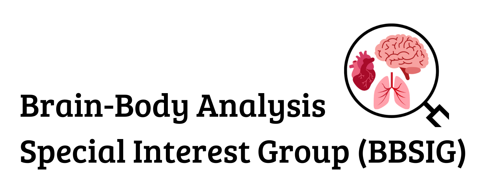
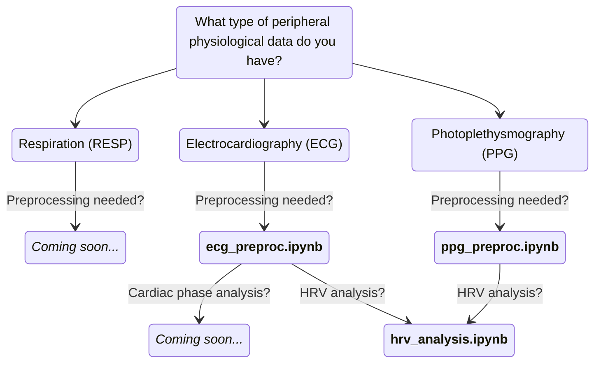

# **Brain-Body Analysis Special Interest Group (BBSIG)**

Welcome to the documentation for the **Brain-Body Analysis Special Interest Group (BBSIG)**!

## **What is BBSIG?**

BBSIG is a **collaborative initiative aimed at streamlining and standardizing the analysis of peripheral physiological data** – mainly cardiovascular activity (electrocardiography [ECG], photoplethysmography [PPG]) and respiration – in relation to brain and behavioral data. Our goal is to develop **accessible, reproducible, and well-documented** analysis pipelines that researchers can integrate into their projects. 

We provide a **set of open-access, Python-based pipelines**, implemented with the modular structure of **Jupyter notebooks**. After comparing existing open-source packages, such as [NeuroKit2](https://neuropsychology.github.io/NeuroKit/index.html) and [Systole](https://github.com/embodied-computation-group/systole), we integrated the most suitable functions for peripheral physiological data processing into a recommended sequence of preprocessing and analysis steps, which can be adapted to each research project. Our pipelines are compatible with the [Brain Imaging Data Structure (BIDS)](https://bids-specification.readthedocs.io/en/stable/) specification for file organization and naming conventions.

Our mission is to **facilitate and enhance the reproducibility and transparency** in peripheral physiological signal analysis by offering **open-access, customizable pipelines with step-by-step tutorials**. Whether you are a novice or an expert in brain-body interactions, BBSIG provides tools and guidance to support your research.

## **Who are we?**

Launched in December 2023, the Brain-Body Analysis Special Interest Group (BBSIG) brings together **over 20 current and former contributors** from several research groups, including the [Mind-Body-Emotion Group](https://www.cbs.mpg.de/departments/neurology/mind-body-emotion), the [Neurology Department at the Max Planck Institute for Human Cognitive and Brain Sciences (MPI CBS)](https://www.cbs.mpg.de/departments/neurology), and the [Social Intelligence Lab](https://social-intelligence-group.github.io/) at the Humboldt-Universität zu Berlin. BBSIG is currently steered by Marta Gerosa (PhD researcher, Mind-Body-Emotion group, MPI CBS) and Dr. Michael Gaebler (PI, Mind-Body-Emotion group, MPI CBS). 

Check the full list of BBSIG contributors [here](https://martager.github.io/bbsig/contributors/). 

## **Current version (v0.0.1)**

Currently, BBSIG v0.0.1 includes the following pipelines:

* **Electrocardiography (ECG) preprocessing (`ecg_preproc.ipynb`)**: preprocess raw ECG data, including signal cleaning, R-peak detection and QRS complex delineation. Then, export key ECG features such as R-peak and T-wave offset locations, RR intervals time-series and interpolated heart rate (HR), useful for later analysis stages. 
* **Photoplethysmography (PPG) preprocessing (`ppg_preproc.ipynb`)**: process raw PPG data, including signal normalization, cleaning, clipping artifacts correction and systolic peaks detection. Then, export key PPG information such as systolic peak locations, RR intervals time-series and interpolated heart rate (HR), useful for later analysis stages. 
* **Heart Rate Variability (HRV) analysis (`hrv_analysis.ipynb`)**: compute time-domain, frequency-domain and non-linear HRV metrics, starting from the previously preprocessed ECG or PPG data (or from your own RR intervals time-series).

*Don't know where to start?* Follow this flowchart to know which BBSIG pipeline is best suited for your project, depending on the peripheral physiological modality and the analysis step to be performed: 

For the full documentation and step-by-step tutorials, visit [here](https://martager.github.io/bbsig/overview/). 

## **Citation**

If you use the BBSIG pipelines in your research, please cite us:

Preliminary citation in APA format - to be confirmed after obtaining the Zenodo DOI: 

*Gerosa M., Agrawal N., Ciston A.B., Fischer A., Fourcade A., Koushik A., Neubauer M., Patyczek A., Piejka A., Reinwarth E., Roellecke L., Shum Y.H., Verschooren S., Gaebler M. (2025). Brain-Body Analysis Special Interest Group (BBSIG) (version 0.0.1) [Computer software]. [https://martager.github.io/bbsig/](https://martager.github.io/bbsig/)*

    

## **Acknowledgments**

Our BBSIG pipelines are largely based on existing toolboxes for peripheral physiological signal processing, which have been compared to find the most suitable functions, or used as inspiration to build own functions. In particular, we would like to acknowledge the following toolboxes: 

* NeuroKit2: [:fontawesome-brands-github: neuropsychology/NeuroKit](https://github.com/neuropsychology/NeuroKit)
    - Makowski, D., Pham, T., Lau, Z. J., Brammer, J. C., Lespinasse, F., Pham, H., Schölzel, C., & Chen, S. A. (2021). NeuroKit2: A Python toolbox for neurophysiological signal processing. Behavior Research Methods, 53(4), 1689-1696. [https://doi.org/10.3758/s13428-020-01516-y](https://doi.org/10.3758/s13428-020-01516-y)
* Systole: [:fontawesome-brands-github: embodied-computation-group/systole](https://github.com/embodied-computation-group/systole)
    - Legrand et al., (2022). Systole: A python package for cardiac signal synchrony and analysis. Journal of Open Source Software, 7(69), 3832, [https://doi.org/10.21105/joss.03832](https://doi.org/10.21105/joss.03832)

