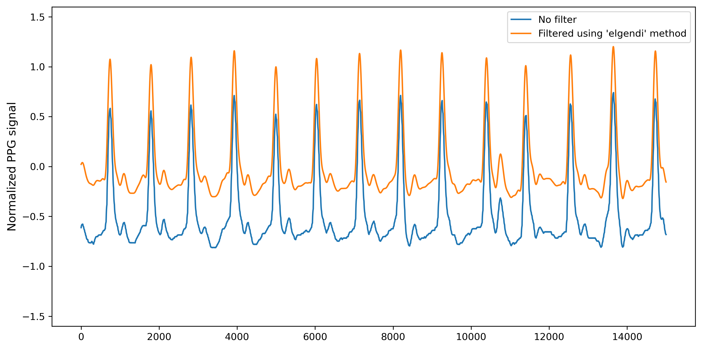
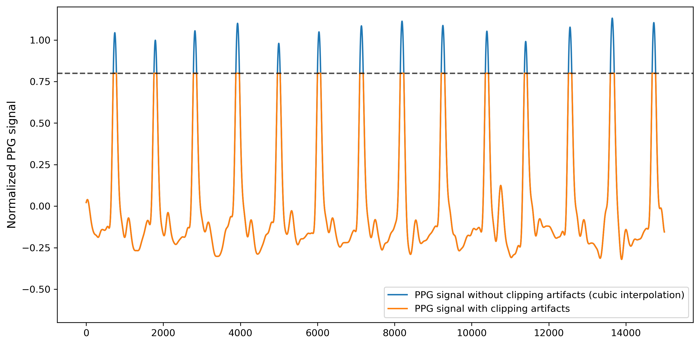
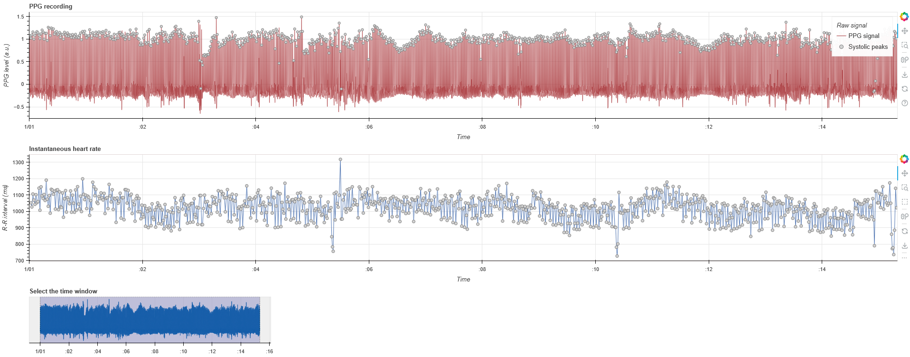
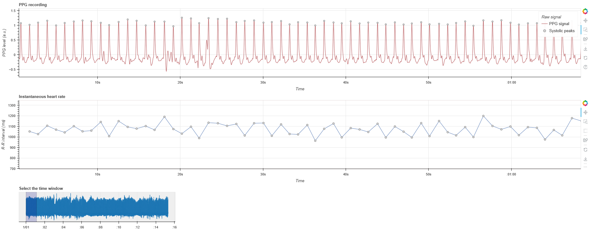
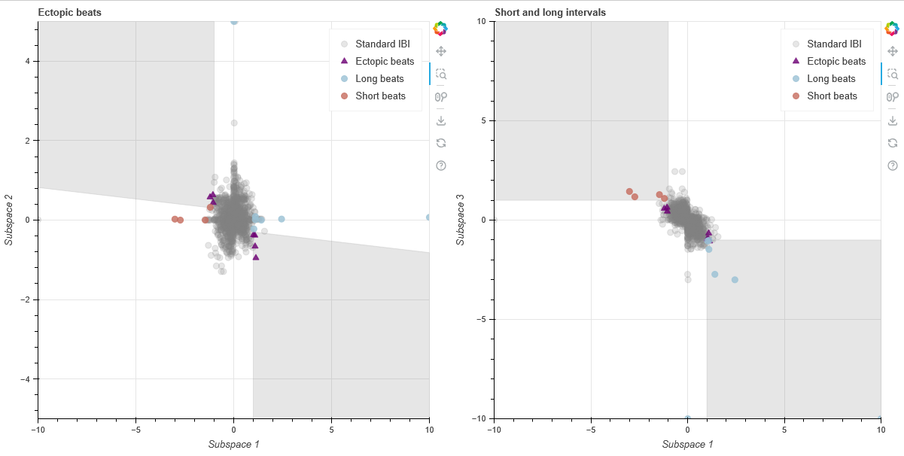
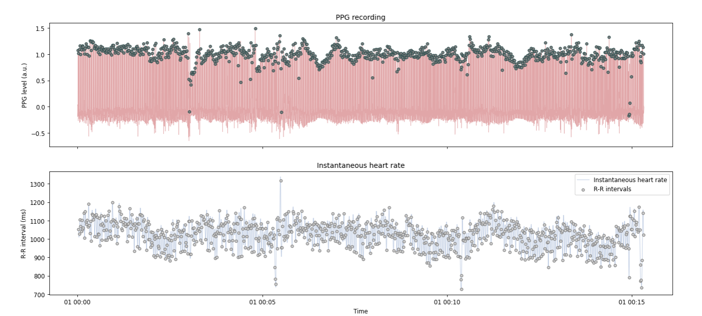
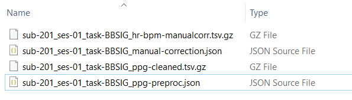

# **PPG preprocessing: `ppg_preproc.ipynb`**

This step-by-step tutorial will walk you through how to use the **Jupyter notebook for preprocessing raw PPG data**, developed as part of the Brain-Body Analysis Special Interest Group (BBSIG). You can find this pipeline under the name: `ppg_preproc.ipynb`.

??? note "Never used a Jupyter notebook before?"

    If you have never used a Jupyter notebook before, visit our setup instructions in the [FAQs](https://martager.github.io/bbsig/faqs/#jupyter-notebooks). Especially if you are planning to perform the manual PPG peak correction, **we recommend following the instructions to run this pipeline locally** in your IDE of choice (e.g., VS Code, PyCharm). 


???+ warning "Before starting: multiple participants or one at a time?"

    This PPG pre-processing pipeline is **designed to run over multiple participants at once**. If you do not want to manually check and edit the peaks locations (see [Sect. 5](https://martager.github.io/bbsig/ppg-preprocessing/#5-manual-ppg-peaks-correction)), each participant will be pre-processed and their summary files will be saved in the respective folder. Just make sure that the optional settings variable `manual_correct` is set to `False`. 

    However, if you plan to use the interactive visualization for the **manual correction** of PPG systolic peaks (via Systole’s `Editor`), **we recommend you run the PPG preprocessing pipeline on one participant (or very few participants) at a time**. The participant ID(s) are included in [Sect. 1](https://martager.github.io/bbsig/ppg-preprocessing/#1-data-import-and-conversion) during data import under the variable `participant_ids`, so you can specify the ID(s) of the participants you want to pre-process and then proceed to run the pipeline until [Sect. 5](https://martager.github.io/bbsig/ppg-preprocessing/#5-manual-ppg-peaks-correction). At that point, you can further specify which participant ID to manually correct under `participants_manual`, proceed with its manual correction and save it, before repeating this section again with a different participant ID. When you are done with manual correction, run the last section ([Sect. 6](https://martager.github.io/bbsig/ppg-preprocessing/#6-data-output)) for data output of all participants. 

    If you leave the `participant_ids` list empty, it will run on all participants in the specified working directory folder.

    ``` py
    ############## Define path for PPG data ##############

    # Set participant IDs - if empty, it will process all participants in the directory
    participant_ids = []  # Adjust as needed, or set to an empty list `[]` to process all participants
    ```

## **Pipeline structure**

The following steps are included in the PPG preprocessing pipeline:

1. [**Data import and conversion**](https://martager.github.io/bbsig/ppg-preprocessing/#1-data-import-and-conversion): import the BIDS-compliant `_physio.tsv.gz` and `_physio.json` files containing the raw PPG signal and its metadata, then convert them into appropriate formats for later processing stages. 

2. [**(Optional) PPG normalization, filtering, & clipping artifact correction**](https://martager.github.io/bbsig/ppg-preprocessing/#2-optional-ppg-normalization-filtering-clipping-artifacts-correction): normalize the signal between 1 and -1 ([Sect. 2a](https://martager.github.io/bbsig/ppg-preprocessing/#2a-ppg-normalization)), clean the PPG signal using NeuroKit2’s `signal_clean()` function (0.5 Hz high-pass and 8Hz low-pass 3rd order Butterworth filters; see [Sect. 2b](https://martager.github.io/bbsig/ppg-preprocessing/#2b-ppg-filtering)). Automatically handles clipping artifacts with Systole’s `find_clipping()` to identify the clipping threshold and `interpolate_clipping()` to interpolate the missing clipped peaks (or troughs); see [Sect. 2c](https://martager.github.io/bbsig/ppg-preprocessing/#2c-ppg-clipping-artifacts-detection-and-interpolation). 

3. [**PPG peaks detection**](https://martager.github.io/bbsig/ppg-preprocessing/#3-ppg-peaks-detection): custom function to detect PPG systolic peaks using NeuroKit2’s `nk.ppg_peaks()` with the 'elgendi' method. Optionally, two complementary automated artifact correction methods can be selected (i.e. NeuroKit2’s internal correction and/or Systole's `correct_peaks()`). Saves uncorrected (and automatically corrected) peak indices, as well as metadata about corrected artifacts (if applicable).

4. [**(Optional) interactive visualization**](https://martager.github.io/bbsig/ppg-preprocessing/#4-optional-interactive-visualization): plot an interactive visualization of ECG signal with systolic peaks and instantaneous heart rate using Systole’s `plot_raw()` function, or produce interactive sub-space plots to identify artifacts (ectopic beats, long/short intervals) using Systole’s `plot_subspaces()` function. Plots can either be shown inside the notebook (if `plot_within_notebook` is set to `True`) or opened in a browser as HTML files. 

5.  [**Manual peaks correction**](https://martager.github.io/bbsig/ppg-preprocessing/#5-manual-ppg-peaks-correction): manually identify and correct mis-detected PPG peaks and label bad segments using Systole’s `Editor`(saves output to `manual-correction.json` in the `derivatives` folder). It is recommended to run this section one participant at a time. 

6. [**Data output**](https://martager.github.io/bbsig/ppg-preprocessing/#6-data-output): export the `_ppg-cleaned.tsv.gz` (optional) and `_ppg-preproc.json` files for each subject in BIDS-compliant format to `/derivatives/ecg-preproc/sub-xx/`. Additionally, an `_hr-bpm-{correction_type}.tsv.gz` file can be saved with interpolated HR (in bpm).


## **Settings: optional pipeline steps**

This section defines a series of variables that can be set to `True` to include the corresponding pipeline steps:

| <div style="width:170px">Variable Name</div> | Function |
| :------------------------------------------- | :------- |
| **`ppg_normalize`** (bool) | **PPG normalization** ([Sect. 2a](https://martager.github.io/bbsig/ppg-preprocessing/#2a-ppg-normalization)): normalizes the raw PPG signal between 1 and -1. |
| **`ppg_filter`** (bool) | **PPG filtering** ([Sect. 2b](https://martager.github.io/bbsig/ppg-preprocessing/#2b-ppg-filtering)): cleans the PPG signal by applying 0.5-8 Hz band-pass 3rd order Butterworth filters. |
| **`clip_artifacts_correct`** (bool) | **PPG clipping artifacts detection and interpolation** ([Sect. 2c](https://martager.github.io/bbsig/ppg-preprocessing/#2c-ppg-clipping-artifacts-detection-and-interpolation)): performs automated clipping artifact correction using Systole's [`find_clipping()`](https://embodied-computation-group.github.io/systole/generated/utils/systole.utils.find_clipping.html) to identify the clipping threshold and `interpolate_clipping()` to interpolate the missing clipped peaks (or troughs). |
| **`correct_artifacts_nk`** (bool) | **PPG automated artifact correction by NeuroKit2** ([Sect. 3](https://martager.github.io/bbsig/ppg-preprocessing/#3-ppg-peaks-detection)): performs automated artifact correction of the PPG systolic peaks using NeuroKit2's `ppg_peaks()` function. | 
| **`correct_artifacts_sys`** (bool) <br>**`iterations = 1`** (numeric) | **PPG automated artifact correction by Systole** ([Sect. 3](https://martager.github.io/bbsig/ppg-preprocessing/#3-ppg-peaks-detection)): performs automated artifact correction of the PPG systolic peaks using Systole's `correct_peaks()` and stores details regarding each type of artifact from RR intervals ("ectopic", "short", "long", "missed", "extra"). The number of detection-correction iterations can be set using the `iterations` variable (defaults to `1`). |
| **`interactive_ppg_plot`** (bool) <br>**`participant_plots = []`** (list) | **Interactive plots of PPG signal with peaks or sub-spaces with artifacts** ([Sect. 4](https://martager.github.io/bbsig/ppg-preprocessing/#4-optional-interactive-visualization)): displays an interactive visualization of the continuous PPG signal with systolic peaks and instantaneous HR, as well as interactive sub-spaces plots to identify artifacts. The participant IDs to-be-plotted can be specified in the list `participant_plots = []`; if left empty, all participants plots will be shown. |
| **`manual_correct`** (bool) <br>**`participant_manual = []`** (list) | **(Optional) manual correction of PPG systolic peaks** ([Sect. 5](https://martager.github.io/bbsig/ppg-preprocessing/#5-manual-ppg-peaks-correction)): activates UI for manual correction of extra peaks, missed peaks and/or falsely detected peaks, using Systole's `Editor`. The UI can also be used to annotate bad segments. Saves a JSON file with the corrected peaks and bad segments. It is recommended to run this section one participant at a time, by specifying the desired ID under `participant_manual = []` each time. | 
| **`hr_interpol`** (bool) | **Save HR interpolation** ([Sect. 6](https://martager.github.io/bbsig/ppg-preprocessing/#6-data-output)): exports interpolated heart rate (HR) values in BPM, using Systole's `utils.heart_rate()`, as TSV file with same sampling rate as original recording. |


## **1. Data import and conversion**

This section imports the physiological data and metadata from the `_physio.tsv.gz` and sidecar `_physio.json` files and extracts the raw PPG data as a numpy array (`ppg_raw`). This array is added to a dictionary (`ppg_dict`) where the data is organized by participant. In detail:

- **Define participants and BIDS file paths**: first, the user specifies the participant ID(s) in the `participant_ids` list. If `participant_ids` is empty, the script automatically includes all participants in the main directory of BIDS-compliant raw data storage (`wd`). The user must specify the root directory of BIDS-compliant raw data storage (`wd`), as well as the mandatory (i.e., task label, datatype) and optional (i.e. session label) BIDS entities (in the format `task-<label>`, `<datatype>` and `ses-<label>`, respectively). These will be used to create a base filename according to BIDS conventions (e.g., `sub-<ID>{_ses-<label>}_task-<label>`) and a base BIDS directory including subject, session (optional) and datatype (e.g., `'sub-<ID>/[ses-<label>/]<datatype>/'`). 
- **Check for `_physio.tsv.gz` and `_physio.json` file existence**: ensures the raw PPG signal and metadata exist for each participant. If either file is missing, the participant is skipped with a warning message.
- **Extract and parse metadata**: read the JSON file to extract key information, including sampling frequency (saved as `sfreq`) and column names used to recognize the PPG data column when reading the TSV.GZ file (expects a column named `ppg`). Additionally reads and decompresses the TSV.GZ file into a pandas DataFrame (`physio_df`) using the extracted column names.
- **Organize PPG data into a dictionary**: the following data from each participant is stored in a dictionary (`ppg_dict`) with the participant IDs (`sub-<label>`) as keys: 
    - `bids_base_filename`: the base PPG filename in BIDS format. 
    - `bids_base_directory`: the base BIDS-compliant folder structure with or without session entity, i.e., `'sub-<ID>/{ses-<label>}/<datatype>/'`. 
    - `ppg_raw`: the raw PPG signal stored as an array.
    - `sfreq`: the sampling frequency of the PPG recording.
- **Define the derivatives path for PPG preprocessed data storage**: defines and creates the directory for storing the PPG preprocessed data, i.e., `derivatives/ppg-preproc/sub-<ID>/...`. 

Please keep in mind that data import parameters must be adapted if your data or folder structure are not BIDS-compliant (check how in the [Organize your BIDS folders](https://martager.github.io/bbsig/bids-structure/) section).

???+ note "Which BIDS entities should be specified for data import?"

    This is what the setup of mandatory and optional BIDS entities could look like when loading the physio data files for two participants, `sub-201` and `sub-202`, called `sub-<ID>_ses-01_task-BBSIG_physio.tsv.gz`, with one session each (`ses-01`) and datatype `beh`, stored in the following BIDS-compliant raw data structure `C:\YourBIDSFolder\sub-<ID>\ses-01\beh\…`. If `participant_ids = []`, all participant IDs in the raw data folder would be included instead. 

    ``` py
    # Set participant IDs
    # If set to an empty list '[]', it will process all participants in the directory
    participant_ids = ['201', '202']  # Adjust as needed: each item should correspond to <ID> of 'sub-<ID>' in BIDS format; otherwise, leave empty for all

    # Specify the main directory of data storage (containing BIDS-compliant raw data)
    wd = r'C:\YourBIDSFolder'  # change with the directory of data storage

    # Mandatory: BIDS entities (task, datatype)
    task_name = 'BBSIG'       # <label> of 'task-<label>' used for file naming in BIDS format
    datatype_name = 'beh'     # datatype used for corresponding directory in BIDS format (e.g., 'beh', 'eeg', 'func')
    physio_name = 'physio'    # physio data specification in BIDS format

    # Optional: BIDS entities (session)
    session_idx = '01'     # <label> of 'ses-<label>' in BIDS format, if available; otherwise, set to None
    ```
    Moreover, if you have additional BIDS entities (e.g., `'run-<label>'` or `'recording-<label>'`), you can easily add them by changing the `bids_base_fname` variable, as this will only impact file naming but not folder structure. This base BIDS filename will be inherited by all data import and export functions. You can read more about mandatory and optional entities in our [short BIDS glossary](https://martager.github.io/bbsig/bids-structure/#the-bids-folder-structure).  

    ``` py
    # If you have additional BIDS entities (e.g., 'run' or 'recording') you can change the bids_base_fname variable accordingly
    bids_base_fname = f'{subj_id}_ses-{session_idx}_task-{task_name}_run-{run_idx}_recording-{rec_name}' 
    ```

The main output from this section is a dictionary, `ppg_dict`, which includes the raw PPG signal (`ppg_raw`) and the sampling frequency `sfreq` for each participant (n.b., this is especially important if different sampling frequencies were used for different participants). This dictionary is the basis of our PPG preprocessing. 

Example structure of `ppg_dict`: 
``` py
{
    'sub-201': {
        'bids_base_filename': 'sub-201_ses-01_task-BBSIG',
        'bids_base_directory': 'sub-201/ses-01/beh/', 
        'ppg_raw': array([-107070.39, -106860.4 , ..., -111120.33, -111090.33]),
        'sfreq': 1000
    },
    'sub-202': {
        'bids_base_filename': 'sub-202_ses-01_task-BBSIG',
        'bids_base_directory': 'sub-202/ses-01/beh/', 
        'ppg_raw': array([-112780.31, -112830.31, ..., -107320.39, -107370.39]),
        'sfreq': 500
    },
    ...
}
```

## **2. (Optional) PPG normalization, filtering & clipping artifact correction**

This section includes a series of optional preprocessing steps for PPG signal correction and cleaning. In detail: 

!!! warning

    If none of these preprocessing steps in [Sect. 2](https://martager.github.io/bbsig/ppg-preprocessing/#2-optional-ppg-normalization-filtering-clipping-artifact-correction) are enabled, all the subsequent sections will rely on the raw PPG signal (`ppg_raw`) instead. Otherwise, subsequent sections will be executed in order of preference using the `ppg_clipping_clean`, `ppg_filt` and `ppg_norm` signal.  


### 2a. PPG normalization
If the variable `ppg_normalize` is set to `True` in the optional pipeline steps (see settings above - defaults to `True`), this part of the code will:

- Define a custom function to **normalize the PPG signal between -1 and 1**. 
- Perform the normalization for all participants in `ppg_dict` and store the normalized PPG signal under the `ppg_norm` key.  

The PPG normalization step ensures consistency and **removes baseline fluctuations**, particularly useful for visualization and comparison across participants.

``` py
# Define custom function to normalize the PPG signal between -1 and 1
def normalize_ppg_signal(ppg_signal):
    
    # Get min and max values from PPG signal
    ppg_min = np.min(ppg_signal)
    ppg_max = np.max(ppg_signal)
    
    # Perform the normalization between -1 and 1
    ppg_norm = 2 * ((ppg_signal - ppg_min) / (ppg_max - ppg_min)) - 1
    
    return ppg_norm
```

Example of the updated `ppg_dict` for a given participant after running this normalization step:
``` py
{'sub-201': {
    'bids_base_filename': 'sub-201_ses-01_task-BBSIG',
    'bids_base_directory': 'sub-201/ses-01/beh/', 
    'ppg_raw': array([-107070.39, -106860.4 , ..., -111120.33, -111090.33]),
    'sfreq': 1000, 
    'ppg_norm': array([-0.61267495, -0.60951383, ..., -0.67364141, -0.6731898])
    },
    ...}
```

### 2b. PPG filtering 
If the variable `ppg_filter` is set to `True` in the optional pipeline steps (see settings above - defaults to `True`), this part of the code will:

- Apply filtering to the PPG signal of each participant using NeuroKit2's [`nk.ppg_clean()`](https://neuropsychology.github.io/NeuroKit/functions/ppg.html#ppg-clean) function. The **filtering method defaults to `elgendi`**, as recommended for general-purpose preprocessing.
- Store the filtered signal for each participant in `ppg_dict()` under the `ppg_filt` key.

If `ppg_filter` is set to `False`, subsequent steps will rely on the raw or normalized signal (`ppg_norm`) instead. 

Example of the updated `ppg_dict` for a given participant after running this filtering step:
``` py
{'sub-201': {
    'bids_base_filename': 'sub-201_ses-01_task-BBSIG',
    'bids_base_directory': 'sub-201/ses-01/beh/', 
    'ppg_raw': array([-107070.39, -106860.4 , ..., -111120.33, -111090.33]),
    'sfreq': 1000, 
    'ppg_norm': array([-0.61267495, -0.60951383, ..., -0.67364141, -0.6731898]),
    'ppg_filt': array([ 0.02183344,  0.02273415,  ..., -0.00014027, -0.00011864])
    },
    ...}
```

For reference, this is how the normalized PPG signal before filtering (blue; corresponding to `ppg_norm`) compares to the cleaned PPG signal after filtering (orange; corresponding to `ppg_filt`) using the `‘elgendi’` method:




### 2c. PPG clipping artifact detection and interpolation 
If the variable `clip_artifacts_correct` is set to `True` in the optional pipeline steps (see settings above), this part of the code will:

- **Detect clipping artifacts** at a minimum and/or maximum threshold using Systole's [`find_clipping()`](https://embodied-computation-group.github.io/systole/generated/utils/systole.utils.find_clipping.html) function.
- **Interpolate over the detected artifacts** with [`interpolate_clipping`](https://embodied-computation-group.github.io/systole/generated/detection/systole.detection.interpolate_clipping.html), using cubic interpolation by default. 
- Save the corrected PPG signal under the `ppg_clipping_clean` key in `ppg_dict`. If clipping artifacts are detected and interpolated for a given participant, this information will be stored under the key `ppg_clipping_interpolation` as `True`. 

??? hint "Unsure whether your PPG signal contains clipping artifacts?"

    If your are unsure whether your PPG signal contains clipping artifacts, we recommend setting `clip_artifacts_correct` to `True` and running this section, as it will automatically detect participants that have clipping artifacts and correct them.

    For comparison, below is an example what a PPG signal could look like with an artificial clipping artifact at a maximum threshold of 0.8, before (orange) and after (blue; corresponding to `ppg_clipping_clean`) applying the clipping artifact interpolation using Systole’s `interpolate_clipping()` with cubic interpolation. In this case, the key `ppg_clipping_interpolation` will be reported as `True`. 

    

If `clip_artifacts_correct` is set to `False`, subsequent steps will rely on the raw,  normalized (`ppg_norm`) or filtered (`ppg_filt`) signal instead. Here is an example of how the updated `ppg_dict` for a given participant would look like after running the clipping artifact correction, including whether the correction was performed on a given participant: 

``` py
{'sub-201': {
    'bids_base_filename': 'sub-201_ses-01_task-BBSIG',
    'bids_base_directory': 'sub-201/ses-01/beh/', 
    'ppg_raw': array([-107070.39, -106860.4 , ..., -111120.33, -111090.33]),
    'sfreq': 1000, 
    'ppg_norm': array([-0.61267495, -0.60951383, ..., -0.67364141, -0.6731898]),
    'ppg_filt': array([ 0.02183344,  0.02273415,  ..., -0.00014027, -0.00011864]),
    'ppg_clipping_clean': array([ 0.02183344,  0.02273415, ..., -0.00014027, -0.00011864]),
    'ppg_clipping_corrected': 'False'
    },
    ...}
```


## **3. PPG peak detection**

This section performs **systolic peak detection** on the provided PPG signal and **optionally applies automated correction**, based on the chosen method. In detail, this section: 

- Defines a custom function `detect_ppg_peaks()` for detecting systolic peaks using NeuroKit2's [`ppg_peaks()`](https://neuropsychology.github.io/NeuroKit/functions/ppg.html#ppg-peaks) with the default method `'elgendi'` (for best results, this method expects the filtered PPG signal, so make sure that `ppg_filter` is set to `True` to execute [Sect. 2b](https://martager.github.io/bbsig/ppg-preprocessing/#2b-ppg-filtering)). Alternatively, PPG peaks detection can be implemented using the method `'bishop'` (suitable only for short time-windows and low sampling frequency e.g., 5 seconds and 100 Hz). 
- Store the indices of the uncorrected systolic peaks in the `'ppg_peaks_info'` dictionary as `'PPG_Peaks_Uncorrected'`. 
- Optionally, implement two complementary methods for artifact correction: 
    - If `correct_artifacts_nk` is set to `True`, it enables artifact correction by Systole or by the automated artifact correction built in to NeuroKit2’s [`ppg_peaks()`](https://neuropsychology.github.io/NeuroKit/functions/ppg.html#ppg-peaks) function.
    - If `correct_artifacts_sys` is set to `True`, it enables artifact correction with Systole's [`correct_peaks()`](https://embodied-computation-group.github.io/systole/generated/correction/systole.correction.correct_peaks.html), which is based on the detection of RR-interval abnormalities. The detection-correction process will be repeated as many times as specified by the `iterations` variable (see settings above; defaults to 1). The indices of the uncorrected artifact types, as well as the number of extra and missed peaks corrected with this method, will be saved in the 'info' dictionary. 

Example usage of the custom `detect_ppg_peaks()` function: 
``` py
detect_ppg_peaks(signal=ppg_signal, 
                 sfreq=sfreq, method='elgendi', 
				 correct_artifacts_nk=correct_artifacts_nk,    # default = True
                 correct_artifacts_sys=correct_artifacts_sys,  # default = True
                 n_iterations=iterations) # default = 1
```

This function returns a dictionary with:

- `ppg_peaks_idx`: indices of detected PPG systolic peaks.
- `ppg_peaks_bool`: boolean array indicating the presence of PPG systolic peaks, with same length as original PPG recording.
- `ppg_peaks_info`: dictionary containing metadata, including:
    - The peak detection method used (`method_peaks`).
    - The automated artifact correction method(s) used (`peaks_correction_neurokit` and/or `peaks_correction_systole`).
    - The indices of artifacts (e.g., missed, extra, ectopic beats) detected before correction (`{artifacttype}_idx_uncorr`).
    - The number of missed/extra beats corrected, if applicable (`info_correction_systole`).

This dictionary containing the detected PPG peaks and their metadata is then appended to `ppg_dict`, as shown in the example below: 
``` py
{'sub-01': 
	   {'ppg_raw': array([ -107070.39, -106860.4 , ..., -111120.33, -111090.33]),
        'sfreq': 1000, 
        'ppg_norm': array([ -0.61267495, -0.60951383, ..., -0.67364141, -0.6731898]),
        'ppg_filt': array([ 0.02183344,  0.02273415,  ..., -0.00014027, -0.00011864]),
        'ppg_clipping_clean': array([ 0.02183344,  0.02273415,  ..., -0.00014027, -0.00011864]),
        'ppg_clipping_corrected': 'False',
        'ppg_peaks_bool': array([ 0, 0, ..., 0, 0]),
        'ppg_peaks_idx': array([ 741, 1793, ..., 917909, 918931], dtype=int64),
        'ppg_peaks_info': 
                    {'method_peaks': 'elgendi',
                    'peaks_correction_neurokit': 'True',
                    'peaks_correction_systole': 'True',
                    'PPG_Peaks_Uncorrected': array([ 741, 1793, ..., 917909, 918931]),
                    'ectopic_idx_uncorr': array([ 94, ..., 886], dtype=int64),
                    'long_idx_uncorr': array([ 174], dtype=int64),
                    'short_idx_uncorr': array([ 91, 309], dtype=int64),
                    'extra_idx_uncorr': array([ 90, ..., 848], dtype=int64),
                    'missed_idx_uncorr': array([], dtype=int64),
                    'info_correction_systole': {'extra': 0, 'missed': 0}}
		},
    ...
}
```

## **4. (Optional) interactive visualization**

If `interactive_ppg_plot` is set to `True`, this section provides two complementary types of interactive visualization of the PPG signal, using Systole's [`plot_raw()`](https://embodied-computation-group.github.io/systole/generated/plots/systole.plots.plot_raw.html) and [`plot_subspaces()`](https://embodied-computation-group.github.io/systole/generated/plots/systole.plots.plot_subspaces.html) functions. If `plot_within_notebook` is set to `True`, the interactive plots for all participants will be rendered within the notebook using Bokeh as the backend, otherwise each plot will be opened as separate HTML file in the browser (note that this is the recommended option when processing many participants at a time). In detail: 

- **4a. Interactive plot of PPG signal and systolic peaks**: display an interactive plots of PPG signal over time with systolic peaks and instantaneous heart rate using Systole's [`plot_raw()`](https://embodied-computation-group.github.io/systole/generated/plots/systole.plots.plot_raw.html). 
- **4b. Interactive plot of subspaces**: display an interactive visualization of PPG subspaces plots, including short/long intervals and ectopic beats using Systole's [`plot_subspaces()`](https://embodied-computation-group.github.io/systole/generated/plots/systole.plots.plot_subspaces.html), based on the artifact detection method described in Lipponen & Tarvainen (2019).

### 4a. Interactive plot of PPG signal and systolic peaks

The interactive visualization of the PPG signal with systolic peaks and/or the instantaneous heart rate is provided by Systole’s [`plot_raw()`](https://embodied-computation-group.github.io/systole/generated/plots/systole.plots.plot_raw.html) function. 

Running this section will either plot within the notebook or open an HTML file that looks like this:





### 4b. Interactive plot of subspaces

Similarly, if the interactive visualization is enabled, subspace plots are created using Systole’s [`plot_subspaces()`](https://embodied-computation-group.github.io/systole/generated/plots/systole.plots.plot_subspaces.html) to allow the identification of artifacts, including short/long intervals and ectopic beats, based on the artifact detection method described in Lipponen & Tarvainen (2019). 

Running this section will either plot within the notebook or open an HTML file that looks like this: 




## **5. Manual PPG peaks correction**

### 5a. Manual PPG peaks correction: interactive plot

If enabled via `manual_correct`, this section triggers the **interactive manual correction of PPG systolic peak locations and identification of noisy segments in the PPG signal** using Systole's `Editor`. Both the raw PPG signal and the instantaneous heart rate are plotted to check for artifacts (e.g., long/short beats, ectopic beats). This interactive plot features a "Correction" mode for deleting peaks or adding them at the local maxima within selected segments, and a "Rejection" mode for marking selected segments as 'bad'. 

This is what the UI for manual peak correction looks like when importing your clean PPG signal and systolic peak locations: 



You can use the tools on the left side to zoom into the signal, scroll along the time axis, or go the previous or next visualization step. 

- With **Correction mode** selected:
    - Click and drag the *left mouse button* to select a segment where all the peaks should be removed.
    - Click and drag the *right mouse button* to select a segment where a peak will be added at the local maximum.
- With **Rejection mode** selected:
    - Click and drag the *right mouse button* to select a segment that should be marked as a bad segment. This will be saved as a pair of indices indicating the onset and offset of the bad segment. 

You can read more about how manual correction works in the Systole official documentation: [Working with BIDS folders - Using the Editor to inspect raw signal](https://embodied-computation-group.github.io/systole/notebooks/6-WorkingWithBIDSFolders.html#using-the-editor-to-inspect-raw-signal). 

It is recommended to **perform manual correction one participant at a time**, by specifying the desired participant ID in the list `participants_manual = []`. Once you are done with manual correction for one participant and have saved the corresponding JSON file by running [Sect. 5b](https://martager.github.io/bbsig/ppg-preprocessing/#5b-manual-ppg-peaks-correction-data-saving), you can change the participant ID and re-run the entire manual correction section again. Note that, after manually correcting a few participants, the interactive plot might become laggy or freeze, so you might want to run the entire preprocessing pipeline only on a handful of participants at a time. 

``` py
if manual_correct:
    participants_manual = ['sub-201'] # change with desired participant ID

    print(f'Manual correction of PPG peaks will be presented for participant: {participants_manual}')
```

??? bug "Bug: recurrent `TypeError` using Systole's `Editor`"
    Just ignore the *TypeError: Figure.set_tight_layout() missing 1 required positional argument: 'tight'* error that will be printed every manual correction or bad segment annotation you perform using Systole's `Editor`. 

### 5b. Manual PPG peaks correction: data saving

Once done with manual correction in the UI, save the results by running the code block in this section. The corrected PPG peak locations and bad segment indices for the participant specified in `participants_manual` are saved to a JSON file (`_manual-corrected.json`) in the `/derivatives/ppg-preproc/sub-<label>/` folder for further processing and analysis. The manual correction process can be repeated for further participants by each time indicating a new participant ID and running the entire section again.

!!! warning
    Make sure that you run the `editor.save()` section (below) only after completing your manual PPG peak correction for the given participant. This will save the output `_manual-corrected.json` file with the information about the new PPG peak locations and bad segments idx pairs. 

    ``` py
    # Execute only when manual peak correction is done
    if manual_correct:
        editor.save()
    ```

??? bug "Bug: Is your sampling frequency different from 1000 Hz? Incorrect `Editor` timescale"

    **Caution when using Systole’s `Editor` for manual correction with sampling rates other than 1000 Hz!** Despite specifying the `sfreq` in the `Editor`’s arguments, the function appears to be using a default sampling frequency of 1000 Hz to calculate the time window of the interactive visualization. As a result, the `Editor` might display your ECG signal in an incorrect time scale, shorter or longer than its actual duration. Despite this bug in the visualization, the manually corrected R-peak and bad segment indices are saved correctly in the output `_systole-corrected.json` file. 

    - For example, if your `sfreq` is 500 Hz and your original ECG signal is 10 min long, the UI will plot the signal with a default sampling frequency of 1000 Hz (i.e. as if 1000 samples were included in 1 sec of recording). This squeezes the timescale of the ECG signal into half its length (i.e., 5 min) and plots equally incorrect RR interval durations for the instantaneous HR, e.g., each heart beat lasting 300 or 400 ms. 
    - A potential temporary solution could be to **resample your data to 1000 Hz**. 


## **6. Data output**

This section exports the PPG preprocessing output files in BIDS-compliant format for each subject in `derivatives/ppg-preproc/sub-<label>/<datatype>/`.

### 6a. (Optional) Export raw and clean PPG data
A custom function, `save_ppg_cleaned()`, saves the BIDS-compliant **`_ppg-cleaned.tsv.gz`** file with two columns: **`ppg_raw`** (the original PPG data) and **`ppg_cleaned`** (the cleaned PPG signal, created by the optional steps in [Sect. 2](https://martager.github.io/bbsig/ppg-preprocessing/#2-optional-ppg-normalization-filtering-clipping-artifact-correction)). This ensures easy access for later stages of analysis and enhances reproducibility. 

If PPG cleaning was performed at the beginning (`ppg_normalize`, `ppg_filter` and/or `clip_artifacts_correct`), this section saves the `_ppg-cleaned.tsv.gz` file with two columns: the original PPG recording (`ppg_raw`) and the cleaned PPG signal with the applied cleaning options (`ppg_cleaned`). 

This is how the `_ppg-cleaned.tsv.gz` TSV file might look (after decompression): 
```ipython3
ppg_raw        ppg_cleaned
-107070.39     0.021833
-106860.40     0.022734
-106670.40     0.023627
-106460.40     0.024509
-106330.41     0.025381
```

### 6b. Export main PPG preprocessing features
A custom function, `save_ppg_preproc()`, saves the **`_ppg-preproc.json` file** containing the following information:

- **`ppg_peaks`** contains the following data: `PPG_Peaks_Uncorr` for uncorrected PPG peak indices; `PPG_Peaks_AutoCorr` for auto-corrected PPG peak indices, if either NeuroKit2's or Systole's artifact correction were used; `PPG_Peaks_ManualCorr` for manually corrected PPG peak indices using Systole's `Editor`. 
- **`rr_s`** contains the RR interval time series (in seconds) created using Systole's `input_conversion(output_type='rr_s')`, based on the uncorrected, auto-corrected and/or manually corrected PPG systolic peak indices (if present). 
- **`bad_segments`** contains index pairs indicating the onsets and offsets of PPG signal segments marked as "bad" using Systole's `Editor`.
- **`info`** contains metadata about the PPG peak detection procedure, including the methods chosen for peak detection and artifact correction, the indices of uncorrected artifacts and the number of extra/missed peaks automatedly corrected. 

This is the crucial final step of our BBBSIG PPG preprocessing pipeline. It stores all the features that have been calculated so far, including: PPG peak locations (uncorrected, automatedly corrected, and/or manually corrected if present); RR interval time series (based on uncorrected, automatedly corrected and/or manually corrected peaks if present); bad segments indices; metadata about the chosen PPG peak detection and correction methods. These are all saved as lists of values (e.g., indices for `ppg_peaks` or seconds for `rr_s`) under the corresponding keys. 

Below is an example of how different sections of the `_ppg-preproc.json` file could look:
``` json
{
    "ppg_peaks": {
        "PPG_Peaks_Uncorr": [ 741, 1793, 2820, ...],
        "PPG_Peaks_AutoCorr": [ 741, 1793, 2820, ...],
        "PPG_Peaks_ManualCorr": [ 741, 1793, 2820, ...]
    },
    "rr_s": {
        "RR_s_Uncorr": [ 1.052, 1.027, 1.106, ...],
        "RR_s_AutoCorr": [ 1.052, 1.027, 1.106, ...],
        "RR_s_ManualCorr": [ 1.052, 1.027, 1.106, ...]
    },
    "bad_segments": [ 278792, 284127, 327740, 331397, 517534, 522042],
    "info": {
        "method_peaks": "elgendi",
        "peaks_correction_neurokit": "True",
        "peaks_correction_systole": "True",
        "ectopic_idx_uncorr": [ 94, 175, ..., 886],
        "long_idx_uncorr": [ 174 ],
        "short_idx_uncorr": [ 91, 309],
        "extra_idx_uncorr": [ 90, 157, ..., 848],
        "missed_idx_uncorr": [],
        "info_correction": {
            "extra": 0,
            "missed": 0
        }
    }
}
```

### 6c. (Optional) Export interpolated HR (in bpm)
A custom function, `save_hr_interpol()`, saves the **interpolated heart rate (HR) values in BPM from the RR interval time series** with the selected correction type (i.e., `manualcorr` > `autocorr` > `uncorr`) to a new file ending in `_hr-bpm-{correction_type}.tsv.gz`.  Please note that interpolated HR values before the first RR interval and after the last RR interval will be filled with NaN values. 

??? bug "Bug: Incorrect HR interpolation with Systole’s heart_rate() with sampling frequences other than 1000 Hz"

    We have identified a **bug in Systole's `heart_rate()` function whenever the `sfreq` argument is set to any value other than the default 1000 Hz**. The interpolated HR values in BPM are incorrectly scaled by the value of `sfreq`, leading to inaccurate results. For example, for an RR interval of 992 ms, which should correspond to 60.48 bpm, calling `heart_rate(sfreq=500)` returns an incorrectly interpolated HR of 30.24 bpm, exactly half the expected value. As a temporary fix, we keep the argument `sfreq` to its default (1000 Hz) when calling this function within the custom `save_hr_interpol()` block. This ensures that interpolated HR values remain correct regardless of the original ECG signal's sampling frequency. 
    
    We are waiting for an official fix from the maintainers of Systole. You can track the progress or read more about this bug here: [opened issue on GitHub](https://github.com/embodied-computation-group/systole/issues/75).

This is what the `_hr-bpm-{correction_type}.tsv.gz` file might look (after decompression) - note that the values shown do not include the NaN values before the first RR interval (which lasted 1.052 s): 
```ipython3
        hr_bpm_manualcorr
1052          57.034221
1053          57.042750
1054          57.051261
1055          57.059753
1056          57.068228
```


## **Good job, your PPG preprocessing is done! 🥳**

If you enabled all optional steps, these are the files which will now be included in the `derivatives/ppg-preproc/sub-<label>/` directory:

- **`_ppg-preproc.json`**: stores the main PPG preprocessing features, including PPG peak indices (uncorrected, auto-corrected, and manually corrected), RR time-series derived from these peak indices, and metadata about artifacts, bad segments and correction. 
- **`_ppg-cleaned.tsv.gz`**: if you enabled the parameter `ppg_filter` in [Sect. 2](https://martager.github.io/bbsig/ppg-preprocessing/#2-optional-ppg-normalization-filtering-clipping-artifact-correction), stores the raw and cleaned PPG signal. 
- **`_manual-corrected.json`**: if you performed manual PPG peak correction and saved its output, stores the Systole's `Editor` output with manually corrected PPG peaks and bad segment indices. See [Sect. 5](https://martager.github.io/bbsig/ppg-preprocessing/#5-manual-ppg-peaks-correction)
- **`_hr-bpm-{correction_type}.tsv.gz`**: if you enabled the parameter `hr_interpol` in [Sect. 6](https://martager.github.io/bbsig/ppg-preprocessing/#6-data-output), stores the interpolated HR values in BPM. 

{ width="500" }
/// caption
///

???+ note "What does the BIDS directory look like after running the ECG preprocessing pipeline?"

    Let's come back to the example BIDS directory from the beginning, where we wanted to preprocess the physio data for two given participants, `sub-201` and `sub-202`, with one session (`ses-01`) each and datatype `beh`. After running this PPG preprocessing pipeline, the BIDS structure should now include a `derivatives/ppg-preproc` folder with sub-folders for each participant, session (optional), and datatype. Within this last folder, the four main output files should be stored. 

    ``` ipython3
    └─ YourBIDSFolder/
        ├─ derivatives/ 
        │   └─ ppg-preproc/
        │       ├─ sub-201/
        │       │   └─ ses-01/
        │       │       └─ beh/
        │       │           ├─ `sub-201_ses-01_task-BBSIG_hr-bpm-manualcorr.tsv.gz`  # optional
        │       │           ├─ `sub-201_ses-01_task-BBSIG_manual-corrected.json`     # optional
        │       │           ├─ `sub-201_ses-01_task-BBSIG_ppg-cleaned.tsv.gz`        # optional       
        │       │           └─ `sub-201_ses-01_task-BBSIG_ppg-preproc.json`          # main output 
        │       ├─ sub-202/
        │       └─ ...
        ├─ sub-201/
        │   └─ ses-01/
        │       └─ beh/
        │           ├─ `sub-201_ses-01_task-BBSIG_physio.json`
        │           └─ `sub-201_ses-01_task-BBSIG_physio.tsv.gz`
        ├─ sub-202/
        └─ ... 
    ```